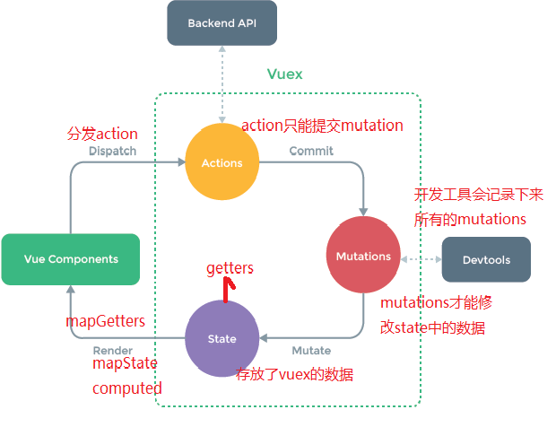

# Vuex

## 基本概念

vuex 是 vue 的状态管理工具，状态即数据。 状态管理就是管理 vue 中的数据

注意：

- 不是所有的场景都适用于 vuex，只有在必要的时候才使用 vuex，如果不必要，尽量别用
- 使用了 vuex 之后，会附加更多的框架中的概念进来，增加了项目的复杂度

## 优点

- vuex 用于解决组件通讯的问题
- vuex 可以集中的管理 vue 项目中用到的所有数据

## 为什么要用 vuex

在大型的项目中，组件通讯会变得很混乱，使用 vuex 可以统一管理组件之间的通讯

## 组成

state 用来数据共享数据存储
mutation 用来注册改变数据状态
getters 用来对共享数据进行过滤操作
action 解决异步改变共享数据
