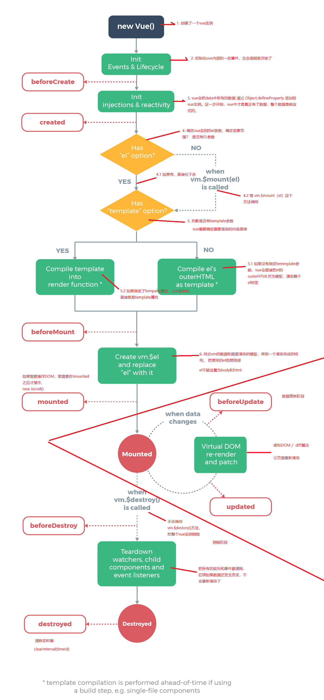

# 1. Vue 生命周期

## 1.1. 什么是 vue 生命周期和生命周期钩子函数？

vue 的生命周期是： vue 实例从创建到销毁，也就是从`开始创建`、`初始化数据`、`编译模板`、`挂载Dom→渲染`、`更新→渲染`、`卸载`等一系列过程。

在这个过程中也会`运行`一些叫做`生命周期钩子的函数`，这给了`用户`在不同阶段`添加自己的代码`的机会。

## 1.2. vue生命周期钩子函数有哪些？

### 1.2.1. 创建期间的生命周期钩子函数

- beforeCreate：在实例初始化之后，此时，还没有初始化好 data 和 methods 属性

- created：实例创建完成后被立即调用，此时 data 和 methods 已经创建 OK，此时还没有开始编译模板。我们可以在这里进行 Ajax ，http 请求也在这里发出。

- beforeMount：此时已经完成了模板的编译，但是还没有挂载到页面中

- mounted：此时，已经将编译好的模板，挂载到了页面指定的容器中显示。（mounted 之后，表示真实 DOM 渲染完了，可以操作 DOM 了）

### 1.2.2. 运行期间的生命周期钩子函数

- beforeUpdate：状态更新之前执行此函数， 此时 data 中的状态值是最新的，但是界面上显示的数据还是旧的，因为此时还没有开始重新渲染 DOM 节点。该钩子在服务器端渲染期间不被调用，因为只有初次渲染会在服务端进行。

- updated：实例更新完毕之后调用此函数，此时 data 中的状态值和界面上显示的数据，都已经完成了更新，界面已经被重新渲染好了。

PS：数据发生变化时，会触发这两个方法。不过，我们一般用 watch 来做。

### 1.2.3. 销毁期间的生命周期钩子函数

- beforeDestroy：实例销毁之前调用。在这一步，实例仍然完全可用。该钩子在服务器端渲染期间不被调用。

- destroyed：Vue 实例销毁后调用。调用后，Vue 实例指示的所有东西都会解绑定，所有的事件监听器会被移除，所有的子实例也会被销毁。

PS：可以在 beforeDestory 里清除定时器、或清除事件绑定。

### 1.2.4. keep-alive 组件期间的声明周期钩子函数

- activated：keep-alive 组件激活时调用。该钩子在服务器端渲染期间不被调用。

- deactivated：keep-alive 组件停用时调用。该钩子在服务器端渲染期间不被调用。

### 1.2.5. 子孙组件错误时被调用（2.5.0+新增）

- errorCaptured：
  `(err: Error, vm: Component, info: string) => ?boolean`
  当捕获一个来自子孙组件的错误时被调用。此钩子会收到三个参数：错误对象、发生错误的组件实例以及一个包含错误来源信息的字符串。此钩子可以返回 false 以阻止该错误继续向上传播。

## 1.3. 生命周期图示

