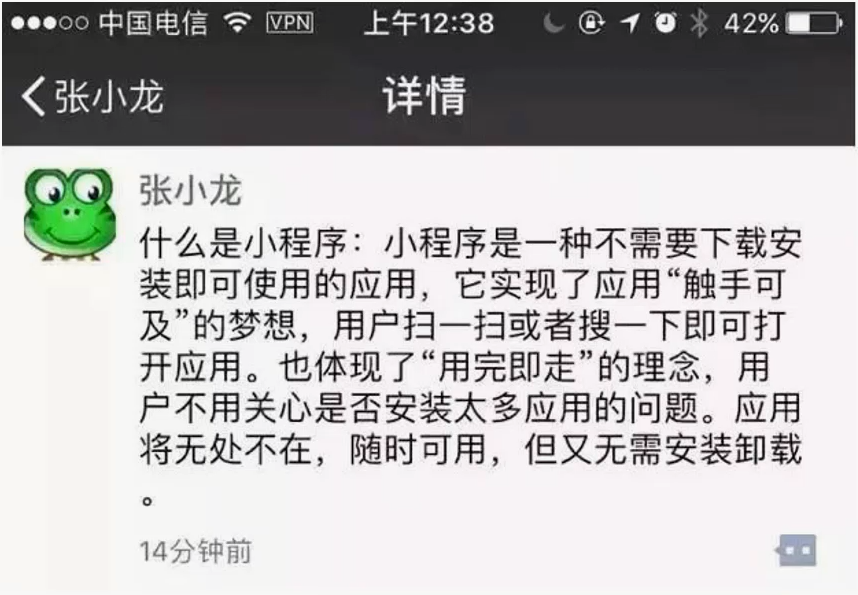

# 1. 微信小程序

## 1.1. 微信小程序简介

> 小程序是一种新型的轻量的开发技术，"微信之父" 张小龙是这样定义小程序的：



- 优点：

  - 用完即走，无需下载，安装，注册，卸载等操作
  - 基于微信，小程序可以非常便捷的获取和传播
  - 每个小程序都有 10 亿的潜在用户

- 缺点：

  - 功能受限于微信，只能在微信内部使用
  - 用户体验没有原生 app 好，依赖于网速

> 小程序不是 web 开发，类似于 web（对前端开发人员友好）

## 1.2. 注册小程序

- [微信公众平台](https://mp.weixin.qq.com/)
- 进入后台：设置 -> 开发设置 -> 拿到 AppID（创建小程序项目使用）

## 1.3. 微信开发者工具

- [安装](https://mp.weixin.qq.com/debug/wxadoc/dev/devtools/download.html)

- [开发者工具使用](https://mp.weixin.qq.com/debug/wxadoc/dev/devtools/devtools.html)

- 说明：第一次使用工具需要使用`注册小程序的微信`扫码登录

- 创建小程序项目：

  - 1 项目目录：使用空目录
  - 2 AppID： 使用注册后获取到的 AppID
  - 3 项目名称：非小程序名称，可以是任意名称
  - 4 建立普通快速启动模板：初始化项目基本结构（空的项目目录中才有这个提示）
  - 5 点击`编译`菜单，运行`QuickStart`项目（模拟器中展示的欢迎页）

- 演示：认识开发者工具

## 1.4. 小程序项目结构

- [代码构成](https://mp.weixin.qq.com/debug/wxadoc/dev/quickstart/basic/file.html)

```html
pages/ ---------------- 页面（组件），所有页面都应该放到这个目录中
index/------------- index文件夹 index.js ---------- index页面的逻辑代码
index.wxml -------- index页面的HTML结构 index.wxss -------- index页面的CSS样式
index.json -------- 页面配置（可选） utils/ ---------------- 公共工具（函数）
app.js ---------------- 逻辑 app.json --------------
全局配置（包括了小程序的所有页面路径、界面表现、网络超时时间、底部 tab 等）
app.wxss -------------- 全局样式（CSS） project.config.json
---开发工具配置（例如ES6转ES5、界面颜色、编译配置等）
```

## 1.5. 微信小程序配置

### 1.5.1. 全局配置

> `app.json`文件用来对微信小程序进行全局配置，决定页面文件的路径、窗口表现、设置网络超时时间、设置多 tab 等。

[官网地址](https://developers.weixin.qq.com/miniprogram/dev/framework/config.html)

#### 1.5.1.1. pages 基本使用

> 用于指定小程序由哪些页面组成，每一项都对应一个页面的 路径+文件名 信息。

```html
app.json 配置说明： 1 所有的页面都需要配置到 `pages` 配置项中 2 `pages`
数组的第一项表示进入小程序要展示的页面
```

window 的基本使用

> 用于设置小程序的状态栏、导航条、标题、窗口背景色。

```js
{
  "window":{
    "navigationBarBackgroundColor": "#ffffff",
    "navigationBarTextStyle": "black",
    "navigationBarTitleText": "微信接口功能演示",
    "backgroundColor": "#eeeeee",
    "backgroundTextStyle": "light"
  }
}
```

#### 1.5.1.2. tabBar 的基本使用

> 如果小程序是一个多 tab 应用（客户端窗口的底部或顶部有 tab 栏可以切换页面），可以通过 tabBar 配置项指定 tab 栏的表现，以及 tab 切换时显示的对应页面。

- 当设置 position 为 top 时，将不会显示 icon
- tabBar 中的 list 是一个数组，只能配置最少 2 个、最多 5 个 tab，tab 按数组的顺序排序
- 注意：没有出现在`tabBar.list`的`pagePath`页面不展示标签栏

#### 1.5.1.3. 其他配置

### 1.5.2. 页面配置

> 每一个小程序页面也可以使用`.json`文件来对本页面的窗口表现进行配置。
>
> 页面的配置只能设置 `app.json` 中部分 `window` 配置项的内容，页面中配置项会覆盖 `app.json` 的 `window` 中相同的配置项。

[文档地址](https://developers.weixin.qq.com/miniprogram/dev/framework/config.html#%E5%85%A8%E5%B1%80%E9%85%8D%E7%BD%AE)

## 1.6. 微信小程序语法

### 1.6.1. WXML

> 从事过网页编程的人知道，网页编程采用的是 HTML + CSS + JS 这样的组合，其中 `HTML` 是用来描述当前这个页面的结构，`CSS` 用来描述页面的样子，`JS` 通常是用来处理这个页面和用户的交互。
>
> 同样道理，在小程序中也有同样的角色，其中 `WXML` 充当的就是类似 `HTML` 的角色。打开 `pages/index/index.wxml`，你会看到以下的内容:

[文档地址](https://developers.weixin.qq.com/miniprogram/dev/quickstart/basic/file.html#json-%E9%85%8D%E7%BD%AE)

### 1.6.2. WXSS

WXSS(WeiXin Style Sheets)是一套样式语言，用于描述 WXML 的组件样式。

WXSS 用来决定 WXML 的组件应该怎么显示。

为了适应广大的前端开发者，WXSS 具有 CSS 大部分特性。同时为了更适合开发微信小程序，WXSS 对 CSS 进行了扩充以及修改。

与 CSS 相比，WXSS 扩展的特性有：

- 尺寸单位
- 样式导入

[文档地址](https://developers.weixin.qq.com/miniprogram/dev/framework/view/wxss.html)

## 1.7. 小程序 js 操作

### 1.7.1. 数据绑定

- WXML 中的动态数据均来自对应 Page 的 `data`

```js
1. 在小程序中，通过{{}}来显示data中的数据
2. 在小程序中，{{}}也可以出现表达式
3. 在插值表达式中不能调用方法
4. 可以在属性中使用插值表达式
```

```html
<view>{{msg}}</view> <view>{{msg + '11'}}</view>
<view>{{msg.toUpperCase()}}</view>

<view><checkbox checked="{{isChecked}}"></checkbox></view>
<view><checkbox checked="{{true}}"></checkbox></view>
```

### 1.7.2. 条件渲染

- wx:if

```html
<view wx:if="{{ isLoading }}"> <text>数据加载中...</text> </view>
<!-- <view wx:elif=""></view> -->
<view wx:else> <text>搞定啦~</text> </view>

<!-- 隐藏多个元素，不改变 wxml的层级结构 -->
<block wx:if="{{ isLoading }}"> <text>小明</text> <text>小红</text> </block>
```

- hidden

```html
<view hidden="{{ isLoading }}"> <text>搞定啦~</text> </view>
```

### 1.7.3. 列表渲染

- `wx:for`：遍历数组，在元素中通过`index`获取索引号，通过`item`获取当前项
- `wx:for-index="idx"`：替换默认的 index
- `wx:for-item="it"`：替换默认的 item
- 注意：**遍历数组元素的时候，需要添加`wx:key`属性，来提高渲染性能**

```html
<view
  wx:for="{{ list }}"
  wx:for-index="idx"
  wx:for-item="itemName"
  wx:key="itemName.id"
>
  {{idx}}: {{itemName.message}}
</view>
```

### 1.7.4. 事件处理

- 绑定事件：1 `bindtap` 2 `catchtap`
- 说明：bind 事件绑定不会阻止冒泡事件向上冒泡，catch 事件绑定可以阻止冒泡事件向上冒泡
- 说明：通过标签的自定义属性`data-*`，实现给事件“传递”参数

```js
;<button bindtap="sayHi" data-msg="test">
  点我吧
</button>

Page({
  sayHi(event) {
    console.log('单击事件触发了~', event.currentTarget.dataset.msg)
  }
})
```

### 1.7.5. 数据操作

- [setData](https://mp.weixin.qq.com/debug/wxadoc/dev/framework/app-service/page.html)
- `setData()`：更新数据
  - 说明：将数据从逻辑层发送到视图层（异步），同时改变对应的 this.data 的值（同步）
  - 1 修改 data 中的数据
  - 2 更新视图，也就是说：视图中使用该数据的地方会重新渲染

```js
this.setData({
  name: 'jack'
})
```

- 文本框操作：

```js
;<input value="{{ input }}" bindinput="inputChangeHandle" />

Page({
  inputChangeHandle: function(e) {
    this.setData({ input: e.detail.value })
  }
})
```

## 1.8. 生命周期

```js
/*
  小程序必须要用app.js文件，在这个文件中必须调用有且只有一次
  App() : 注册一个小程序， 参数是一个对象，可以在对象中指定生命周期钩子函数。
*/
App({
  // 小程序的钩子函数
  // 小程序在运行的时候就会触发的钩子函数，只会触发一次
  // 可以在onLaunch实现一些小程序初始化就需要做的事情
  // 获取用户的信息，让微信授权登录
  onLaunch() {
    console.log('onLaunch', '小程序运行了')
  },

  // 小程序每次显示出来就要执行
  onShow() {
    console.log('onShow')
  },
  // 小程序隐藏的时候就要执行
  onHide() {
    console.log('onHIde')
  },
  // 当小程序报错了，就会执行onError
  // 收集错误信息
  onError() {
    console.log('onError')
  }
})
```

页面生命周期

```js
onLoad(options) {
    console.log('onLoad监听页面加载');
  }

  onReady() {
    console.log('onReady监听页面初次渲染完成');
  }

  onShow() {
    console.log('onShow监听页面显示');
  }

  onHide() {
    console.log('onHide监听页面隐藏');
  }

  onUnload() {
    console.log('onUnload监听页面卸载');
  }
```
