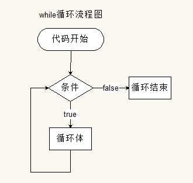

# 1. 语句

<!-- TOC -->

- [1. 语句](#1-语句)
  - [1.1. 顺序语句](#11-顺序语句)
  - [1.2. 分支语句](#12-分支语句)
    - [1.2.1. if 语句](#121-if-语句)
      - [1.2.1.1. 单分支结构](#1211-单分支结构)
      - [1.2.1.2. 两路分支结构](#1212-两路分支结构)
      - [1.2.1.3. 多路分支结构](#1213-多路分支结构)
    - [1.2.2. switch 语句](#122-switch-语句)
  - [1.3. 循环语句](#13-循环语句)
    - [1.3.1. while 循环语句](#131-while-循环语句)
    - [1.3.2. do-while 循环语句](#132-do-while-循环语句)
    - [1.3.3. for 循环语句](#133-for-循环语句)
  - [1.4. break 和 continue 语句](#14-break-和-continue-语句)
    - [1.4.1. break](#141-break)
    - [1.4.2. continue](#142-continue)

<!-- /TOC -->

## 1.1. 顺序语句

所谓顺序结构程序就是指按语句出现的先后顺序执行的程序结构，是结构化程序中最简单的结构。
编程语言并不提供专门的控制流语句来表达顺序控制结构，而是用程序语句的自然排列顺序来表达。计算机按此顺序逐条执行语句，当一条语句执行完毕，控制自动转到下一条语句。


## 1.2. 分支语句

分支结构又称为选择结构。当程序执行到控制分支的语句时，首先判断条件，根据条件表达式的值选择相应的语句执行（放弃另一部分语句的执行）。


### 1.2.1. if 语句

#### 1.2.1.1. 单分支结构

```JavaScript
if(条件表达式){
    当条件为真，执行这个代码；
}
```

#### 1.2.1.2. 两路分支结构

```JavaScript
if(条件){
    当条件为真，执行这个代码；
}else{
    当条件为假，执行这个代码；
}
```

#### 1.2.1.3. 多路分支结构

```JavaScript
  if (条件1) {
  条件1为真的时候执行的代码块
  } else if (条件2) {
  条件1为假的时候并且条件2为真的时候执行的代码块
  } else if (条件N) {
  上述条件都不满足并且条件N满足的时候执行的代码块
  } else {
  上述条件都不满足的时候执行的代码  安全出口
  }
```

### 1.2.2. switch 语句

```JavaScript
switch(n)
  {
    case 1:
    执行代码块 1
    break;
    case 2:
    执行代码块 2
    break;
    default:
    n 与 case 1 和 case 2 不同时执行的代码
}
```

switch 语句中的每一种情形（case）的含义是：如果表达式等于这个值，则执行后面的语句。

而 break 关键字会导致到吗执行流跳出 switch 语句。如果省略 break 关键字，会导致执行完当前 case 后，继续执行下一个 case。

最后的 default 关键字则用于在表达式不匹配前面任何一种情形的时候，执行代码。

注意：

1. switch case 语句不能完全替代 if else
2. switch case 比较的值全等 ===
3. switch case 一般需要配合 break 关键字使用 没有 break 会造成 case 穿透

## 1.3. 循环语句

### 1.3.1. while 循环语句

while 语句属于前测试循环语句，在循环体内的代码被执行之前，就会对出口条件求值。因此循环体内的代码有可能永远不会被执行。



```JavaScript
while(条件){

    //条件为真时会不断执行这个代码
    //直到while的条件为假
}
```

### 1.3.2. do-while 循环语句

do while 语句是一种后测试循环语句，即只有在循环体中的代码执行之后，才会测试出口条件。换句话说，在对条件表达式求值之前，循环体内的代码至少会被执行一次。


```JavaScript
do{
    // 循环语句
}while(true)
```

### 1.3.3. for 循环语句

for 语句也是一种前测试循环语句。但它具有在执行循环之前初始化变量和定义循环后要执行的代码的能力。


语法：

```JavaScript
for (语句 1; 语句 2; 语句 3)
  {
  被执行的代码块
  }
//语句 1 初始化语句，用来初始化变量

//语句 2 循环（代码块）的条件

//语句 3 在循环（代码块）已被执行之后执行
```

## 1.4. break 和 continue 语句

break 和 continue 语句用于在循环中精确地控制代码的执行。

### 1.4.1. break

- break 可以用来退出 switch 语句或整个循环语句（循环语句包括 for、while。不包括 if。if 里不能用 break，否则会报错）。

- break 会立即终止离它最近的那个循环语句。

### 1.4.2. continue

- continue 可以用来跳过当次循环。

- 同样，continue 默认只会离他最近的循环起作用。

```JavaScript
for (var i = 1; i <= 10; i++) {
      if( i == 5) {
    // 跳出整个循环 break后面的代码不会运行 同时整个循环结束
        break;
      }
      console.log(i);
```

continue 语句中断循环中的迭代，如果出现了指定的条件，然后继续循环中的下一个迭代。

```JavaScript
if( i == 5) {
      // 跳出当前循环 continue后面的代码不会运行 会直接进行到下一次的循环
      continue;
    }
    console.log(i);
  }
```
