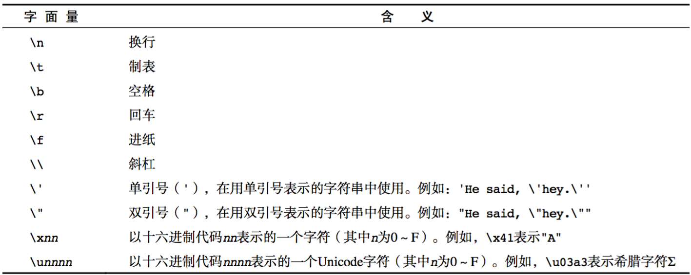

<!-- TOC -->

- [1. JavaScript 基础 01（注释、变量、数据类型）](#1-javascript-基础-01注释变量数据类型)
  - [1.1. JavaScript 注释](#11-javascript-注释)
    - [1.1.1. 单行注释](#111-单行注释)
    - [1.1.2. 多行注释](#112-多行注释)
    - [1.1.3. 文档注释](#113-文档注释)
  - [1.2. JavaScript 变量](#12-javascript-变量)
    - [1.2.1. 什么是变量](#121-什么是变量)
    - [1.2.2. 如何使用变量](#122-如何使用变量)
    - [1.2.3. 变量的命名规则和规范](#123-变量的命名规则和规范)
  - [1.3. JavaScript 数据类型](#13-javascript-数据类型)
    - [1.3.1. `typeof` 操作符](#131-typeof-操作符)
    - [1.3.2. `number` 数据类型](#132-number-数据类型)
    - [1.3.3. `string` 数据类型](#133-string-数据类型)
    - [1.3.4. `Boolean` 布尔类型](#134-boolean-布尔类型)
    - [1.3.5. `Undefined` 类型](#135-undefined-类型)
    - [1.3.6. `Null` 类型](#136-null-类型)
  - [1.4. JavaScript 数据类型转换](#14-javascript-数据类型转换)
    - [1.4.1. 将数据转换成 number（数值型）](#141-将数据转换成-number数值型)
      - [1.4.1.1. `parseInt()`](#1411-parseint)
      - [1.4.1.2. `parseFloat()`](#1412-parsefloat)
      - [1.4.1.3. `Number（）`](#1413-number)
    - [1.4.2. 将数据转换成字符串](#142-将数据转换成字符串)
      - [1.4.2.1. `toString()`](#1421-tostring)
      - [1.4.2.2. `String()`](#1422-string)
    - [1.4.3. 将数据转换成布尔类型](#143-将数据转换成布尔类型)

<!-- /TOC -->

# 1. JavaScript 基础 01（注释、变量、数据类型）

## 1.1. JavaScript 注释

ECMAScript 使用 C 风格的注释，包括单行注释和块级注释。单行注释以两个斜杠开头，块级注释以一个斜杠和一个星号（/_）开头，以一个星号和一个斜杠（_/）结尾。

### 1.1.1. 单行注释

```JavaScript
用来描述一个或多行代码
// 这是一个变量
var name = 'hm';
```

### 1.1.2. 多行注释

```JavaScript
用来注释多行代码
/*
var age = 18;
var name = 'zs';
console.log(name, age);
*/
```

### 1.1.3. 文档注释

文档注释在 JS 中一般用于对函数进行注释，对函数的参数及返回值进行说明。

```JavaScript
/**
* 获取圆的面积
* @param r {number} 圆的半径
* @returns {number} 根据半径计算出来的圆的面积
*/
  function getArea(r) {
  return Math.PI _ r \* r;
  }
```

虽然上面注释中的第二三四行都以一个星号开头，但这不是必需的。之所以添加那两个星号，纯粹是为了提高注释的可读性（这种格式在企业级应用中用得比较多）

## 1.2. JavaScript 变量

### 1.2.1. 什么是变量

- 什么是变量

变量是计算机内存中存储数据的标识符，根据变量名称可以获取到内存中存储的数据。

- 为什么要使用变量

使用变量可以方便的获取或者修改内存中的数据，方便程序员来使用.

### 1.2.2. 如何使用变量

1. 声明并赋值

```JavaScript
   var age=18;
```

2. 先声明，后赋值

```JavaScript
   var age;
   age = 18;
```

3. 同时声明多个变量，并单独赋值

```JavaScript
   var age, name, sex;
   age = 10;
   name = 'zs';
```

4. 同时声明多个变量并赋值

```JavaScript
var age = 10, name = 'zs';
```

5. 不声明直接赋值。不要这么使用，会带来作用域问题

```JavaScript
a = 1;
```

6. 不声明不赋值直接使用。直接报错

### 1.2.3. 变量的命名规则和规范

- 规则 - 必须遵守的，不遵守会报错
  - 由字母、数字、下划线、$符号组成，不能以数字开头，必须以字母开头
  - 不能是关键字和保留字，例如：for、while。(变量名称为 `name` 的注意点)
  - 关键字：对于 JS 来说有特殊意义的字符 [查询保留字和关键字](https://developer.mozilla.org/en-US/docs/Web/JavaScript/Reference/Lexical_grammar#Keywords)
  - 保留字：现在没有意义 但是保留在那边 以后可能会有意义的字符
  - 区分大小写
- 规范 - 建议遵守的，不遵守不会报错
  - 变量名必须有意义
  - 遵守驼峰命名法。首字母小写，后面单词的首字母需要大写。例如：`userName`、`userPassword`

## 1.3. JavaScript 数据类型

在程序设计中，数据类型被定义为数据的种类，也就是说一系列可能值以及基于这些值的基本操作。 好处：更加充分和高效的利用内存和使用数据。

- 基本数据类型（简单数据类型）
  - `number` 数值型
  - `string` 字符串
  - `boolean` 布尔型
  - `undefined` 未定义
  - `null` 空引用
- 引用数据类型（复杂数据类型）
  - `object` 对象
  - `function` 函数
  - `array` 数组

### 1.3.1. `typeof` 操作符

鉴于 `ECMAScript` 是松散类型的，因此需要有一种手段来检测给定变量的数据类型——`typeof` 就是负责提供这方面信息的操作符。对一个值使用 `typeof` 操作符可能返回下列某个字符串：

- `“undefined”`——如果这个值未定义；
- `“Boolean”`——如果这个值是布尔值；
- `“string”`——如果这个值是字符串；
- `“number”`——如果这个值是数值；
- `“object”`——如果这个值是对象或 null；
- `“function”`——如果这个值是函数。

### 1.3.2. `number` 数据类型

`Number` 类型应该是 `ECMAScript` 中最令人关注的数据类型了。这种类型使用 `IEEE754` 格式来表示整数和浮点数。为支持各种数值类型，`ECMA-262` 定义了不同的数值字面量格式。
最基本的数值字面量格式是十进制整数，十进制整数可以直接在代码中输入。
八进制字面值的第一位必须是 0，然后是八进制数字序列。如果字面值中的数值超出了范围，那么前导 0 将被忽略，后面的数值将被当作十进制数值解析。
十六进制字面值的前两位必须是 0x，后跟任何十六进制数字（0~9 及 A~F)。其中字母 A~F 可以大写也可以小写。

1. 浮点数值
   所谓浮点数值，就是该数值中必须包含一个小数点，并且小数点后面必须至少有一位数字。虽然小数点前面可以没有整数，但我们不推荐这种写法。
   由于保存浮点数值需要的内存空间是保存整数值的两倍，因此 ECMAScript 会不失时机地将浮点数值转换为整数值。显然，如果小数点后面没有跟任何数字，那么这个数值就可以作为整数值来保存。同样的，如果浮点数本身表示的就是一个整数（如 1.0），那么该值也会被转换为整数。
   对于那些极大或极小的数值，可以用 e 表示（科学表示法）表示的浮点数值表示。用 e 表示法表示的数值等于 e 前面的数值乘以 10 的指数次幂。
   浮点数值的最高精度是 `17` 位小数，但在进行算术计算时其精确度远远不如整数。例如 `0.1+0.2` 的结果不是 `0.3`，而是 `0.30000000000000004`，这个小小的舍入误差会导致无法测试特定的浮点数值。（解决方式，提高倍数转换成整数进行运算）
2. 数值范围
   由于内存限制，`ECMAScript` 并不能保存世界上所有的数值。`ECMAScript` 能够表示的最小数值保存在 `Number.MIN_VALUE` 中——在大多数浏览器中，这个值是 `5e-324`；能够表示的最大数值保存在 `Number.MAX_VALUE` 中——在大多数浏览器中，这个值是 `1.7976931348623157e+308`。如果某次计算的结果得到了一个超出 `JavaScript` 数值范围的值，那么这个数值将被自动转换成特殊的 `Infinity` 值。具体来说，如果这个数值是复数，则会被转换成`-Infinity`（负无穷），如果这个数值是正数，则会被转换成 `Infinity`（正无穷）。
3. `NaN`
   `NaN`，即非数值（Not a Number）是一个特殊的数值。这个数值用于表示一个本来要返回数值的操作数未返回数值的情况。例如，在其他编程语言中，任何数值除以非数值都会导致错误，从而停止代码执行。但在 `ECMAScript` 中，任何数值除以非数值会返回 `NaN`，因此不会影响其他代码的执行。
   `NaN` 本身有两个非同寻常的特点。首先，任何涉及 `NaN` 的操作都会返回 `NaN`，这个特点在多步计算中有可能导致问题。其次，`NaN` 与任何值都不相等，包括 `NaN` 本身。

### 1.3.3. `string` 数据类型

`String` 类型用于表示由 0 或多个 16 位 `Unicode` 字符组成的字符序列，即字符串。
字符串由成对的双引号（“）或单引号（‘）表示
转义字符：

这些字符可以出现在字符串中的任意位置，而且也将被作为一个字符来解析

### 1.3.4. `Boolean` 布尔类型

`Boolean` 类型是 `ECAMScript` 中使用得最多的一种类型，该类型只有两个字面值：`true` 和 `false`。这两个值与数字值不是一回事。因此 `true` 不一定等于 `1`，而 `false` 也不一定等于`0`。

### 1.3.5. `Undefined` 类型

`undefined` 类型只有一个值，即特殊的 `undefined`。在使用 `var` 声明变量但未对其加以初始化时，这个变量的值就是 `undefined`。

### 1.3.6. `Null` 类型

`Null` 类型是第二个只有一个值的数据类型，这个特殊的值是 `null`。从逻辑角度上来看，`null` 值表示一个空对象指针，而这也正是使用 `typeof` 操作符检测 `null` 值时会返回`“object”`的原因。一般用来将某些数据清空。

## 1.4. JavaScript 数据类型转换

### 1.4.1. 将数据转换成 number（数值型）

#### 1.4.1.1. `parseInt()`

- `parseInt()`把字符串转换成整数，小数点后的直接忽略
- `parseInt()`函数在转换字符串时，更多的是看其是否符合数值模式。它会忽略字符串前面的空格，直至找到第一个非空格字符。如果第一个字符不是数字字符或者负号，`parseInt（）`就会返回 `NaN`。如果第一个字符是数字字符，就继续解析第二个字符，直到解析完所有后续字符或者遇到了一个非数字字符。
- 如果字符串中的第一个字符是数字字符，`parseInt（）`也能够识别出各种整数格式（十进制，八进制，十六进制）

#### 1.4.1.2. `parseFloat()`

- 把字符串转换成浮点数 `parseFloat` 会解析第一个. 遇到第二个 . 或者非数字结束 如果解析的内容里只有整数，解析成整数
- `parseFloat()`也是从第一个字符开始解析每个字符，一直解析到字符串末尾，或者解析到遇见一个无效的浮点数字字符为止。
- 字符串中的第一个小数点是有效的，第二个小数点无效，因此它后面的字符串将被忽略。
- 始终都会忽略前导的 0，因此不能解析十六进制，十六进制格式的字符串始终会被转换成 0
- 如果字符串包含的是一个可解析为整数的数，那么 `parseInt（）`会返回整数。

#### 1.4.1.3. `Number（）`

- 可以用于任何数字类型
- 如果是 `Boolean` 值，`true` 和 `false` 将分别被转换为 `1` 和 `0`
- 如果是数字值，只是简单的传入和返回
- 如果是 `null` 值，返回 `0`
- 如果是 `undefined`，返回 `NaN`
- 如果是字符串，遵循下列规则：
  - 如果字符串中只包含数字，则将其转换为十进制数值（前导 0 会被忽略）
  - 如果字符串中包含有效的浮点格式，如“1.1”，则将其转换为对用的浮点数值（前导 0 会被忽略）
  - 如果字符串中包含有效的十六进制格式，则将其转换为相同大小的十进制整数值
  - 如果字符串是空的，则将其转换为 `0`
  - 如果字符串中包含除上述格式之外的字符，将其转换为 `NaN`
  - 黑科技（隐式转换）如果在数字字符串前面添加一个+号，会自动隐式转换成数字类型

### 1.4.2. 将数据转换成字符串

#### 1.4.2.1. `toString()`

- 数值、布尔值、对象和字符串值都有`toString()`方法，但 `null` 和 `undefined` 没有这个方法。
- 多数情况下，调用 `toString()`方法不必传递参数。但是，在调用数值的`toString()`方法时，可以传递一个参数：输出数值的基数。默认情况下，`toString()`方法以十进制格式返回数值的字符串表示，而通过传递基数，`toString()`可以输出以二进制、八进制、十六进制，乃至其他任意有效进制格式表示的字符串值。

#### 1.4.2.2. `String()`

- 在不知道要转换的值是不是`null`或 `undefined`的情况下，还可以使用转型函数`String()`，这个函数能够将任何类型的值转换为字符串。`String()`函数遵循下列转换规则：
  - 如果值有 `toString()`方法，则调用该方法并返回相应的结果。
  - 如果值是`null`，则返回`“null”`。
  - 如果值是 `undefined`，则返回`“undefined”`。
  - 黑科技（隐式转换）
    任何数据只需要跟字符串相加最终结果一定是字符串

### 1.4.3. 将数据转换成布尔类型

虽然 `Boolean` 类型的字面值只有两个。但 `ECAMScript`中所有类型的值都是有与这两个 `Boolean` 值等价的值。要将一个值转换为其对应的 `Boolean` 值，可以调用转型函数 `boolean()`
数据类型|转换为 true 的值|转换为 false 的值
---|---|---
Boolean|true|false
String|任何非空字符串 |“”（空字符串）
Number|任何非零数字值（包括无穷大）| 0 和 NaN
Object|任何对象| null
Undefined|n/a（not applicable）不适用| undefined
