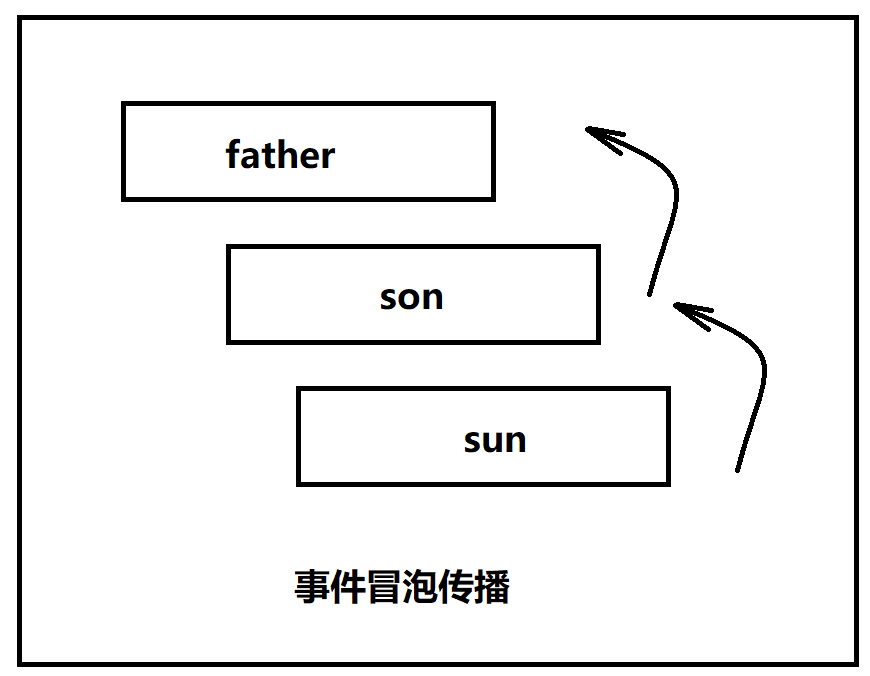
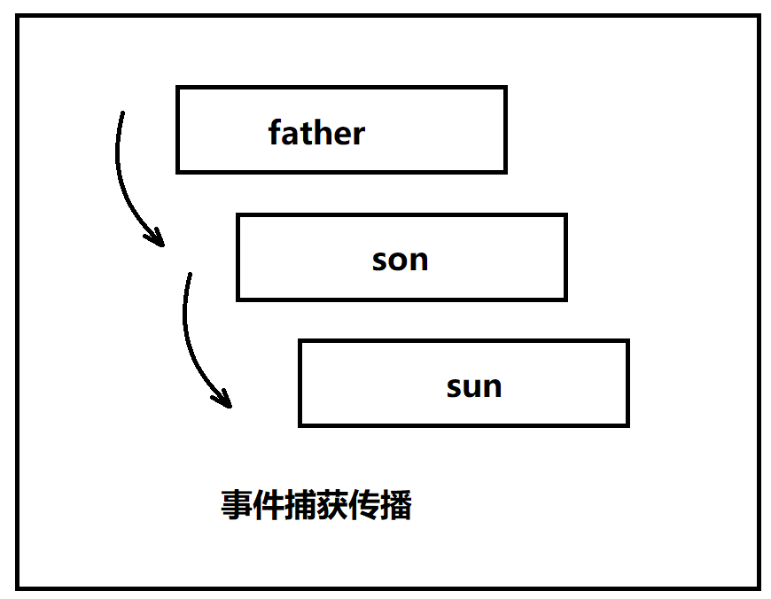
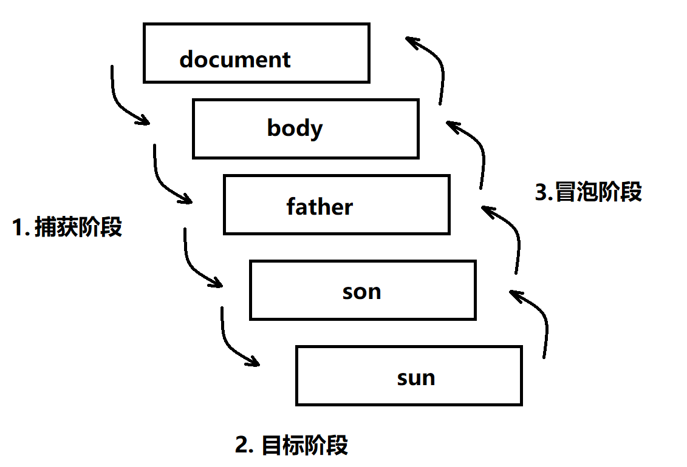

# 1. 事件

<!-- TOC -->

- [1. 事件](#1-事件)
  - [1.1. 事件流](#11-事件流)
    - [1.1.1. 事件冒泡](#111-事件冒泡)
    - [1.1.2. 事件捕获](#112-事件捕获)
    - [1.1.3. DOM 事件流](#113-dom-事件流)
  - [1.2. 事件处理程序](#12-事件处理程序)
    - [1.2.1. HTML 事件处理程序](#121-html-事件处理程序)
    - [1.2.2. DOM0 级事件处理程序](#122-dom0-级事件处理程序)
      - [1.2.2.1. 定义事件处理程序](#1221-定义事件处理程序)
      - [1.2.2.2. 删除事件处理程序](#1222-删除事件处理程序)
    - [1.2.3. DOM2 级事件处理程序](#123-dom2-级事件处理程序)
  - [1.3. 事件对象](#13-事件对象)
    - [1.3.1. DOM 中的事件对象](#131-dom-中的事件对象)
    - [1.3.2. IE 中的事件对象](#132-ie-中的事件对象)
    - [1.3.3. 跨浏览器的事件对象](#133-跨浏览器的事件对象)
  - [1.4. 事件类型](#14-事件类型)
    - [1.4.1. UI 事件](#141-ui-事件)
      - [1.4.1.1. load 事件](#1411-load-事件)
      - [1.4.1.2. unload 事件](#1412-unload-事件)
      - [1.4.1.3. resize 事件](#1413-resize-事件)
      - [1.4.1.4. scroll 事件](#1414-scroll-事件)
    - [1.4.2. 焦点事件](#142-焦点事件)
    - [1.4.3. 鼠标事件](#143-鼠标事件)
    - [1.4.4. 滚轮事件](#144-滚轮事件)
    - [1.4.5. 文本事件](#145-文本事件)
    - [1.4.6. 键盘事件](#146-键盘事件)
      - [1.4.6.1. 键码](#1461-键码)
    - [1.4.7. 变动事件](#147-变动事件)
    - [1.4.8. HTML5 事件](#148-html5-事件)
      - [1.4.8.1. contextmenu 事件](#1481-contextmenu-事件)
      - [1.4.8.2. beforeunload 事件](#1482-beforeunload-事件)
      - [1.4.8.3. DOMContentLoaded 事件](#1483-domcontentloaded-事件)
      - [1.4.8.4. readystatechange 事件](#1484-readystatechange-事件)
      - [1.4.8.5. pageshow 事件和 pagehide 事件](#1485-pageshow-事件和-pagehide-事件)
      - [1.4.8.6. hashchange 事件](#1486-hashchange-事件)

<!-- /TOC -->

## 1.1. 事件流

指从页面中接收事件的顺序，有冒泡流和捕获流。
　　当页面中发生某种事件（比如鼠标点击，鼠标滑过等）时，毫无疑问子元素和父元素都会接收到该事件，可具体顺序是怎样的呢？IE 和 Netscape 开发团队提出了几乎是完全相反的事件流概念。

### 1.1.1. 事件冒泡

> IE 的事件流叫做**事件冒泡**（event bubbling），即事件开始时由文档中嵌套层次最深的那个节点触发，然后逐级向上传播到其父元素依次被触发。



**拓展** : 阻止事件冒泡：`event.stopPropagation()`

```JavaScript
//1. 因为是事件的冒泡,,因事件引起,也要因事件停止
father/son/sun.onclick = function (event) {

    //stop :停止  propagation：传播
    event.stopPropagation();
}

// onclick : 默认就是 第三个参数为 false:
 father.addEventListener('click',function(){
    alert('father');
  },false);
```

### 1.1.2. 事件捕获

> ​ 　　 Netscape Communicator 团队提出的另一种事件流叫做**事件捕获**（event capturing），事件的处理将从 DOM 层次的根开始，而不是从触发事件的目标元素开始，事件被从目标元素的所有祖先元素依次往下传递。



```JavaScript
//当addEventListener第三个参数为true时，表示事件捕获
// 参数3 : 是否捕获
arr[i].addEventListener(
  "click",
  function() {
    console.log(this);
  },
  true
);
```

### 1.1.3. DOM 事件流

“DOM2 级事件”规定的时间流包括三个阶段：

1. 事件的捕获阶段
2. 事件的目标阶段（触发自己的事件）
3. 事件的冒泡阶段



- 若捕获事件和冒泡事件都存在，首先发生的是捕获阶段，然后是目标阶段，最后才是冒泡阶段。
- `addEventListener()` 第三个参数为是否捕获：
  - 如果为 `true` 时, 表示该事件在捕获阶段发生，
  - 如果为 `false` 时 , 表示该事件在冒泡阶段发生，

**兼容 ：** IE8 及更早版本不支持 DOM 事件流。

## 1.2. 事件处理程序

事件就是用户或浏览器自身执行的某种动作。诸如 `click`、`load` 和 `mouseover`，都是事件的名字。而响应某个事件的函数就叫做**事件处理程序**（或**事件监听器**）。

### 1.2.1. HTML 事件处理程序

可以使用 HTML 为元素指定事件处理程序，方法是：为元素添加一个与事件处理程序同名的属性，该属性的值是能够执行的 JS 代码或 JS 函数。

**示例**：

```JavaScript
//直接定义JS代码
<input type="button" value="点击" onclick="alert('clicked')" />

//调用在页面其他地方定义的JS函数
<input type="button" value="点击" onclick="showMessage()" />
```

### 1.2.2. DOM0 级事件处理程序

> 通过 `JavaScript` 指定事件处理程序的传统方式，就是将一个函数赋值给一个事件处理程序属性。这种为事件处理程序赋值的方法是在第四代 Web 浏览器中出现的，而且至今仍然为所有现代浏览器所支持。原因一是简单，二是具有跨浏览器的优势。

#### 1.2.2.1. 定义事件处理程序

- 使用 JS 代码来给事件指定事件处理程序，方法是：将一个函数赋值给一个事件处理程序属性。
- 每个元素都有自己的事件处理程序属性，这些属性的名字与事件处理程序的名字相同，如 `onclick`。

```JavaScript
var btn = document.getElementById("myBtn");
//为按钮指定onclick事件处理程序
btn.onclick = function(){
    alert("Clicked");
}
```

**注意**：

- 使用 DOM0 级方法指定的事件处理程序被认为是元素的方法。因此，这时候的事件处理程序是在元素的作用域中运行；换句话说，程序中的 this 引用当前元素。
- 单击按钮显示的是元素的 ID，这个 ID 是通过 `this.id` 取得的。不仅仅是 ID，实际上可以在事件处理程序中通过 `this` 访问元素的任何属性和方法。以这种方式添加的事件处理程序会在事件流的冒泡阶段被处理

#### 1.2.2.2. 删除事件处理程序

将事件处理程序属性的值设置为 `null` 即可删除事件处理程序：

```JavaScript
btn.onclick = null;
```

### 1.2.3. DOM2 级事件处理程序

“DOM2 级事件”定义了两个方法，用于处理指定和删除事件处理程序的操作：

- addEventListener(要处理的事件名，事件处理程序函数，布尔值)
  - 布尔值取值为 false：在冒泡阶段调用事件处理程序
  - 布尔值取值为 true：在捕获阶段调用事件处理程序
- removeEventListener(要处理的事件名，事件处理程序函数，布尔值)

大多数都是将事件处理程序添加到冒泡阶段，从而保证跨浏览器的兼容性，故通常都是将最后一个参数设为 false
所有的 DOM 节点都包含上述两个方法
DOM2 级添加的事件处理程序也是在其依附的元素的作用域中运行的
使用 DOM2 级方法可以为同一个元素添加多个事件处理程序，这些事件处理程序会按照添加它们的顺序从上到下执行（DOM0 级只能为同一个元素添加一个事件处理程序）

## 1.3. 事件对象

### 1.3.1. DOM 中的事件对象

在触发 DOM 上的某个事件时，会产生一个事件对象 event，这个对象中包含着所有与事件有关的信息。包括导致事件的元素、事件的类型以及与特定事件相关的信息。鼠标事件触发时，事件对象中会包含鼠标的位置信息。键盘事件触发时，事件对象中会包含按下的键相关的信息。

现代浏览器获取 :

```JavaScript
// 给一个形参即可
btn.onclick = function(event){
//event 就是事件对象，里面包含了事件触发时的一些信息。
console.log(event);
}
```

低版本浏览器 (ie678):

```JavaScript
btn.onclick = function(){
//IE678 通过 window.event 获取事件对象
console.log(window.event);
}
```

兼容性 :

```JavaScript
btn.onclick = function(event){
//只要用到了事件对象，就要记得处理浏览器兼容性
event = event || window.event;
}
```

event 对象包含与创建它的特定事件有关的属性和方法。出发的事件类型不一样，可用的属性和方法也不一样。不过，所有事件都会有下表列出的成员。
| 属性/方法 | 类型 | 读/写 | 说明 |
| -------------------------- | -------- | ----- | ---------------------------------------------------------------------- |
| bubbles | Boolean | 只读 | 表明事件是否冒泡 |
| cancelable | Boolean | 只读 | 表明是否可以取消事件的默认行为 |
| currentTarget | Element | 只读 | 表明事件处理程序当前正在处理的元素 |
| defaultPervented | Boolean | 只读 | 为 true 表示已经调用了 preventDefault()方法 |
| detail | Integer | 只读 | 表示与事件相关的细节信息 |
| eventPhase | Integer | 只读 | 调用事件处理程序的阶段：1 表示捕获阶段，2 表示目标阶段，3 表示冒泡阶段 |
| preventDefault() | Function | 只读 | 取消事件的默认行为 |
| stopImmediatePropagation() | Function | 只读 | 取消事件的进一步捕获或冒泡，同时阻止任何事件处理程序被调用 |
| stopPropagation() | Function | 只读 | 阻止事件进一步捕获或冒泡 |
| target | Element | 只读 | 目标元素 |
| type | String | 只读 | 被触发的事件类型 |

---

### 1.3.2. IE 中的事件对象

| 属性/方法    | 类型    | 读/写 | 说明                                                                |
| ------------ | ------- | ----- | ------------------------------------------------------------------- |
| cancelBubble | Boolean | 读写  | 默认为 false。用于取消事件冒泡，与 DOM 中的 stopPropagation（）相同 |
| returnValue  | Boolean | 读写  | 默认为 true，用于取消默认行为，与 DOM 中的 preventDeafault（）相同  |
| srcElement   | Element | 只读  | 事件目标元素，与 DOM 中的 target 相同                               |
| type         | String  | 只读  | 被触发的事件类型                                                    |

### 1.3.3. 跨浏览器的事件对象

```JavaScript
var eventUtil = {
    addHandler: function(ele, type, handler) {
        // 代码在上文，
    },
    getEvent: function(event) {
        return event || window.event;
    },
    getTarget: function(event) {
        // 该语句可以不用，关键是传入的event是否已经被处理
        // var event = event || window.event;
        return event.target || event.srcElement;
    },
    preventDefault: function(event) {
        if(event.preventDefault) {
            event.preventDefault();
        } else {
            event.returnValue = false;
        }
    },
    removeHandler: function(ele, type, handler) {
        // 省略代码
    },
    stopPropagation: function(event) {
        if(event.stopPropagation) {
            event.stopPropagation(();
        } else {
            event.cancelBubble = true;
        }
    },
};
```

## 1.4. 事件类型

“DOM3 级事件”规定了以下几类事件：

- UI 事件，当用户与页面上的元素交互时触发；
- 焦点事件，当元素获得或失去焦点时触发；
- 鼠标事件，当用户通过鼠标在页面上执行操作时触发；
- 滚轮事件，当使用鼠标滚轮时触发；
- 文本事件，当在文档中输入文本时触发；
- 键盘事件，当用户通过键盘在页面上执行操作时触发；
- 复合事件，当为 IME(Input Method Editor,输入法编辑器)输入字符时触发；
- 变动事件，当底层 DOM 结构发生变化时；
- HTML5 事件
- 设备事件
- 触摸与手势事件

### 1.4.1. UI 事件

UI 事件指的是那些不一定与用户操作有关的事件。

#### 1.4.1.1. load 事件

当页面完全加载后（包括所有图像、JavaScript 文件、CSS 文件等外部资源），就会触发 window 上的 load 事件。

```JavaScript
//我们经常会使用这种形式，即当页面完全加载完之后执行其中的函数。
window.onload=function(){};

//当图片完全加载出来之后执行。
var img=document.getElementById("img");
EventUtil.addHandler(img,"load",function(){
      event=EventUtil.getEvent(event);
      alert(EventUtil.getTarget(event).src);
});
```

#### 1.4.1.2. unload 事件

与 load 事件对应的事件是 onload 事件，这个事件在文档被完全卸载后触发。即只要用户从一个页面切换到另一个页面，就会触发。

这个事件最多的情况就是**清除引用、以避免内存泄露。**

与 load 事件类似，也有两种指定 onload 事件处理程序的方式。一种是 JavaScript 方式，使用 EventUtil.addHandler()；另一种就是在 body 元素中添加一个特性。

无论使用哪种方式，都要小心编写 onunload 事件中的代码。既然 unload 事件是在一切都被卸载之后才触发，那么在页面加载后存在的那些对象。此时就不一定存在了。

```JavaScript
EventUtil.addHandler(window, "unload",function(event){
  alert("unload");
});

<body onload="alert('changed')">
```

#### 1.4.1.3. resize 事件

当调整浏览器的窗口到一个新的宽度或高度时，就会触发 resize 事件。这个事件在 window（窗口）上面触发。因此同样可以通过 JS 或者 body 元素中的 onresize 特性来指定处理程序。

浏览器窗口最小化或最大化时也会触发 resize 事件。

```JavaScript
EventUtil.addHandler(window, "resize",function(event){
  alert("resized");
});
```

#### 1.4.1.4. scroll 事件

对于有滚动条的盒子, 可以使用 onscroll 注册滚动事件。每滚动一像素，就会触发该事件。
此事件是在 window 对象上发生的，但它实际表示的则是页面中相应元素的变化。可以通过`<body>`元素的 scrollLeft 和 scrollTop 来监控这一变化。

```JavaScript
var div = doucment.getElementById(“div”);
div.onscroll = function(){

console.log(div.scrollLeft);
console.log(div.scrollTop);
}
```

页面被卷去的高度和宽度的兼容性

```JavaScript
// 给整个页面注册滚动事件
document.onscroll = function() {
var scrollTop = window.pageYOffset || document.documentElement.scrollTop || document.body.scrollTop || 0;
var scrollLeft = window.pageXOffset || document.documentElement.scrollLeft || document.body.scrollLeft || 0
}
```

### 1.4.2. 焦点事件

焦点事件会在页面元素获得焦点时触发。

- blur 在元素失去焦点时触发。这个事件不冒泡，所有浏览器都支持。
- focus 在元素获得焦点时触发。这个事件不冒泡，所有浏览器都支持。
- focusin 在元素获得焦点时触发。这个事件冒泡,某些浏览器不支持。
- focusout 在元素失去焦点时触发。这个事件冒泡，某些浏览器不支持。

要确定浏览器是否支持这些事件，可以使用如下代码：

```JavaScript
var is Supported = document.implementation.hasFeature("FocusEvent","3.0");
```

**注意**：即使 blur 和 focus 不冒泡，也可以在捕获阶段侦听到他们。

### 1.4.3. 鼠标事件

鼠标事件是 Web 开发中最常用的一类事件，因为鼠标是最主要的定位设备。DOM3 级事件中定义了 9 个鼠标事件：

1. click：用户单击鼠标左键或按下回车键触发。
2. dbclick：用户双击鼠标左键触发。
3. mousedown：在用户按下了任意鼠标按钮时触发。
4. mouseenter：在鼠标光标从元素外部首次移动到元素范围内时触发。此事件**不冒泡**。
5. mouseleave：元素上方的光标移动到元素范围之外时触发。**不冒泡**。
6. mousemove：光标在元素的内部不断的移动时触发。
7. mouseover：鼠标指针位于一个元素外部，然后用户将首次移动到另一个元素边界之内时触发。
8. mouseout：用户将光标从一个元素上方移动到另一个元素时触发。
9. mouseup：在用户释放鼠标按钮时触发。

**重要**：只有在同一个元素上相继触发 mousedown 和 mouseup 事件，才会触发 click 事件。同样，只有在同一个元素上触发两次 click 事件，才会触发 dbclick 事件。

dbclick 事件的产生过程如下：

1. mousedown
2. mouseup
3. click
4. mousedown
5. mouseup
6. click
7. dbclick

### 1.4.4. 滚轮事件

当用户通过鼠标滑轮（滚轮）与页面交互、上下滚动页面时，会触发一个叫 mousewheel 的事件即鼠标滑动事件。该事件的 event 对象不仅包含了鼠标事件的所有信息，还包含一个叫做 wheelDelta 属性，当鼠标滑轮滚动时，该属性返回 120 的倍数。当向前滑动时（即页面向下滑动），wheelDelta 属性返回-120 的倍数，当向后滑动时（即页面向上滑动），wheelDelta 属性返回+120 的倍数。

### 1.4.5. 文本事件

textInput:这是唯一的文本事件，当用户在可编辑区域输入字符时，会触发该事件。

textInput 事件与 keypress 事件的区别：

1. textInput 事件只有在可输入区域才能触发，而 keypress 事件就是只要任何获取焦点的元素就会触发该事件。

2. 只有输入实际的字符才能触发 textInput 事件，而 keypress 事件，只要按下是否能影响文本显示的按键时就能触发。

textInput 事件考虑的是字符，因为该事件的 Event 对象只有一个 data 属性，该属性包含的值就是用户输入的字符，包括字符的大小写形式。

### 1.4.6. 键盘事件

1. keydown：当用户按下键盘上的任意键时触发。按住不放，会重复触发。
2. keypress:当用户按下键盘上的字符键时触发。按住不放，会重复触发。
3. keyup:当用户释放键盘上的键时触发。

当用户按了一下字符键时，首先会触发 keydown 事件，接着会触发 keypress 事件，最后会触发 keyup 事件。

#### 1.4.6.1. 键码

当触发 keydown 和 keyup 事件时，其 event 对象有个叫做 keyCode 的属性，其包含了用户所按下的按键的字符键码。

注：keyCode 属性不会区分字符大小写状态的，例如：不管是大写 A 还是小写 a 均返回 65。

**字母和数字键的键码值(keyCode)**：
| 按键 | 键码 | 按键 | 键码 | 按键 | 键码 | 按键 | 键码 |
| ---- | ---- | ---- | ---- | ---- | ---- | ---- | ---- |
| A | 65 | J | 74 | S | 83 | 1 | 49 |
| B | 66 | K | 75 | T | 84 | 2 | 50 |
| C | 67 | L | 76 | U | 85 | 3 | 51 |
| D | 68 | M | 77 | V | 86 | 4 | 52 |
| E | 69 | N | 78 | W | 87 | 5 | 53 |
| F | 70 | O | 79 | X | 88 | 6 | 54 |
| G | 71 | P | 80 | Y | 89 | 7 | 55 |
| H | 72 | Q | 81 | Z | 90 | 8 | 56 |
| I | 73 | R | 82 | 0 | 48 | 9 | 57 |

**数字键盘上的键的键码值(keyCode)**：
按键 | 键码 | 按键 | 键码
---|---|---|---
0 |96| 8| 104
1 |97 |9| 105
2| 98| \* |106
3| 99 |+| 107
4| 100 |Enter| 108
5 |101| - |109
6 |102| .| 110
7| 103| /| 111

**功能键键码值(keyCode)**：
按键| 键码 |按键| 键码
---|---|---|---
F1 |112 |F7 |118
F2 |113 |F8 |119
F3 |114 |F9 |120
F4 |115| F10| 121
F5 |116 |F11 |122
F6 |117| F12 |123

**控制键键码值(keyCode)**：
按键|键码|按键|键码|按键|键码|按键|键码
---|---|---|---|---|---|---|---
BackSpace|8|Esc|27|Right Arrow|39|-\_|189
Tab|9|Spacebar|32|Down Arrow|40|.>|190
Clear|12|Page Up|33|Insert|45|/?|191
Enter|13|Page Down|34|Delete|46|`~|192
Shift|16|End|35|Num Lock|144|[{|219
Control|17|Home|36|;:|186|/\||220
Alt|18|Left Arrow|37|=+|187|]}|221
Cape Lock |20

### 1.4.7. 变动事件

DOM 中某一部分发生变化时就会触发。如删除节点、插入节点等操作。DOM2 级中的变动事件如下：

1. DOMSubtreeModified：在 DOM 结构中发生任何变化时触发。这个事件在其它事件触发后都会触发。
2. DOMNodeRemoved：在节点从其父节点中移出时触发。（删除节点时）
3. DOMNodeInserted：在一个节点作为另一个节点的子节点插入时触发。（插入节点）
4. DOMNodeInsertedIntoDocument：在一个节点直接被插入到文档中或通过 DOM 子树结构插入到文档中时触发。
5. DOMNodeRemovedFromDocument：在一个节点直接从文档中移出或通过 DOM 子树结构移出时触发。
6. DOMAttrModified: 在特性被修改之后触发。
7. DOMCharacterDataModified: 在文本节点的值发生变化时触发。

### 1.4.8. HTML5 事件

#### 1.4.8.1. contextmenu 事件

默认的上下文菜单栏：当点击鼠标右键时，会出现一个默认的菜单栏。为了实现自定义的上下文菜单，开发人员遇见的主要问题是：如何确定要显示的菜单，如果隐藏和操作菜单。于是 contextmenu 事件出现了。

contextmenu 事件属于鼠标事件，一般为鼠标右键事件，它是冒泡的，所以可以为 document 指定一个事件处理程序。该事件的目标是被用户操作的元素。
那么为实现了自定义的上下文菜单，首先是阻止鼠标右键的默认行为（即点击鼠标右键弹出默认菜单栏）。contextmenu 事件属于鼠标事件，那么就可以通过 event 对象得到鼠标的位置，恰好自定义菜单出现的位置也是鼠标单击的位置。

通常使用 contextmenu 事件来显示自定义的菜单栏，而通过鼠标的 click 事件来隐藏该菜单栏。

#### 1.4.8.2. beforeunload 事件

当卸载页面、或者重新刷新页面时，可能我们没有保存数据，刷新之后，数据就会消失。如果给 window 添加一个叫 beforeunload()的事件处理程序，那么当我们要重新刷新页面时，页面会弹出警告框，要我们确认是否要刷新这个页面，这是一个友好的提示：

#### 1.4.8.3. DOMContentLoaded 事件

window 的 load 事件会在页面加载完成之后触发，但这个过程可能会因为要加载的资源大多而等的时间较长。DOMContentLoaded 事件在形成完整的 DOM 结构之后就会触发，而不必等到图像、JavaScript 资源、CSS 资源加载完毕之后才触发。这样用户就可以早点与浏览器交互。可以为 document 或 window 添加处理程序，但目标还是 document。

#### 1.4.8.4. readystatechange 事件

该事件的目的是提供与文档或元素加载状态有关的信息。readystatechange 事件的 Event 对象有个 readyState 属性，保存着状态值。状态值有 5 个：

1. uninitialized(未初始化)：对象存在但未初始化。
2. loading：对象正在加载数据。
3. loaded：对象已经加载完数据。
4. interactive：可以操作对象了，但未完全加载。
5. compelete：对象已经加载完毕。

#### 1.4.8.5. pageshow 事件和 pagehide 事件

#### 1.4.8.6. hashchange 事件

HTML5 新增了一个 hashchange 事件，该事件反应了 URL 变化的信息和状态。Event 对象中有两个属性：oldURL 和 newURL。分别表示变化前的 URL 和变化后的 URL。通常用于 Ajax 技术。
