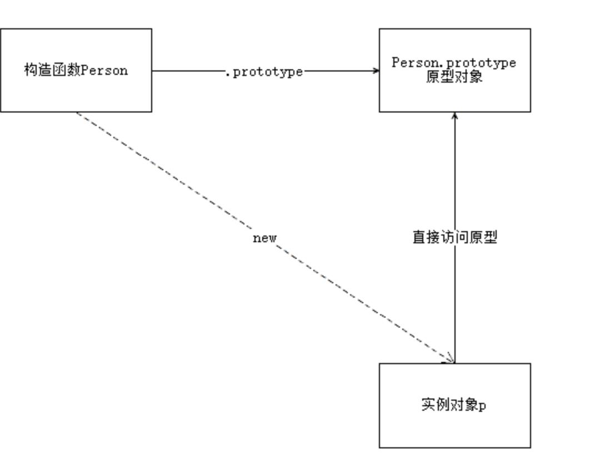
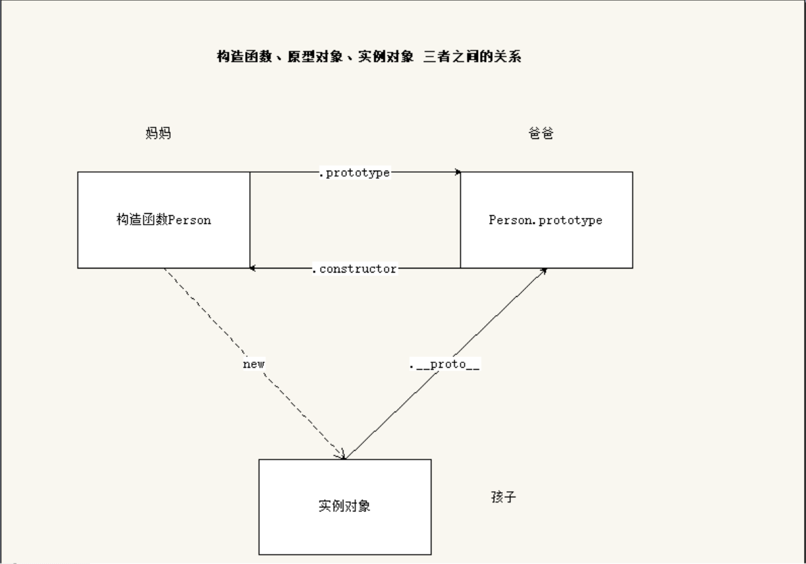
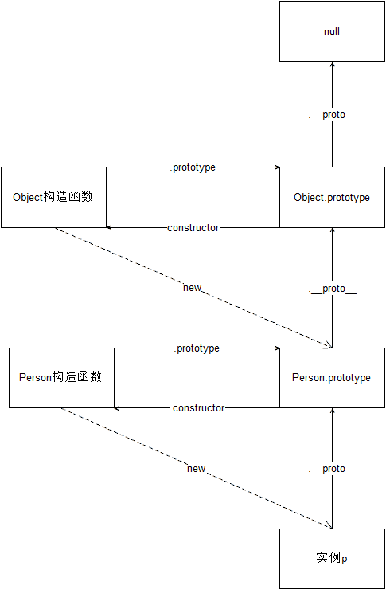

# 1. 原型和原型链

在 JavaScript 中,一共有两种类型的值,原始值和对象值。每个对象都有一个内部属性 prototype ,我们通常称之为原型。原型的值可以是一个对象,也可以是 null。如果它的值是一个对象，则这个对象也一定有自己的原型。这样就形成了一条线性的链，我们称之为原型链。

## 1.1. 原型

### 1.1.1. 原型基本概念

Javascript 规定，我们创建的每一个函数都有一个 `prototype` 属性，这个属性是一个指针，指向另一个对象。

这个对象的所有属性和方法，都会被构造函数的实例继承。

这也就意味着，我们可以把所有对象实例需要共享的属性和方法直接定义在 `prototype` 对象上。

```javascript
function Person (name, age) {
  this.name = name
  this.age = age
}

console.log(Person.prototype)

Person.prototype.type = 'human'

Person.prototype.sayName = function () {
  console.log(this.name)
}

var p1 = new Person(...)
var p2 = new Person(...)

console.log(p1.sayName === p2.sayName) // => true
```

这时所有实例的 `type` 属性和 `sayName()` 方法，其实都是同一个内存地址

### 1.1.2. 构造函数、实例、原型三者之间的关系

**构造函数**：构造函数就是一个函数，配合 new 可以新建对象。构造函数中有一个 `prototype` 属性，这个属性是一个指针，指向它的原型对象。

**实例**：通过**构造函数**创建出来的对象我们把它叫做构造函数的实例。一个构造函数可以有很多实例。实例一创造出来就具有 `constructor` 属性（指向构造函数）和`__proto__`属性（指向原型对象）。

**原型**：每一个构造函数都有一个属性`prototype`，函数的 `prototype` 属性值就是原型。通过构造函数创建出来的实例能够直接使用原型上的属性和方法。



### 1.1.3. `__proto__`属性

任意一个对象，都会有`__proto__`属性，这个属性指向了构造函数的 `prototype` 属性，也就是原型对象。

获取原型对象：

- 通过 `构造函数.prototype` 可以获取
- 通过 `实例.__proto__` 可以获取（隐式原型）
- 它们指向了同一个对象 `构造函数.prototype === 实例.__proto__`

**注意**：`__proto__` 是浏览器的一个隐藏（私有）属性，早期的 IE 浏览器不支持，所以说不要在线上项目中去使用它。本地开发中可以通过实例知道实例对象可以访问原型上的哪些成员。不要通过它来修改原型里的内容，如果要修改原型中的内容，使用 `构造函数.prototype` 去修改.

### 1.1.4. constructor 属性

默认情况下，原型对象中只包含了一个属性：constructor，constructor 属性指向了当前的构造函数。



## 1.2. 原型链

### 1.2.1. 原型链概念

任何一个对象，都有原型对象，原型对象本身又是一个对象，所以原型对象也有自己的原型对象，这样一环扣一环就形成了一个链式结构，我们把这个链式结构称为：**原型链**。

绘制对象的原型链结构：

```javascript
//1. var p = new Person();
//2. var o = new Object();
//3. var arr = new Array();
//4. var date = new Date();
//5. Math
//6. 查看一个div的原型链结构
```

总结：Object.prototype 是原型链的尽头，Object.prototype 的原型是 null。



### 1.2.2. 属性查找原则

如果是获取操作

1. 会先在自身上查找，如果没有
2. 则根据`__proto__`对应的原型去找，如果没有
3. 一直找到`Object.prototyp`，如果没有，那就找不到了。

如果是修改操作：

只会修改对象自身的属性，如果自身没有这个属性，那么就会添加这个属性，并不会修改原型中的属性。

### 1.2.3. Object.prototype 对象的方法

#### 1.2.3.1. `hasOwnProperty()`

**语法**：对象.hasOwnProperty("属性");

**作用**：该方法会返回一个布尔值，判断对象是否具有指定的属性是自身的属性。

```javascript
var obj = {
  name: "zs"
};
//判断name属性是不是obj自己提供的
console.log(obj.hasOwnProperty("name")); //true
console.log(obj.hasOwnProperty("toString")); //false
```

in 运算符：
**语法**： "属性" in 对象
**作用**： 判断该属性能否被对象访问到，也就是说，不管这个属性是对象自身的，还是来源于原型链上，只要能够访问到，就返回 true

```JavaScript
function Person(name){
this.name = name;
}
var p = new Person("zs");

console.log("name" in p); // true
console.log("hasOwnProperty" in p); // true
console.log("toString" in p); // true
console.log("push" in []); // true
console.log(p.hasOwnProperty("hasOwnProperty")); // false
```

hasOwnProperty() 与 in 的区别
in 操作符：如果属性不是自己提供的，是从原型上继承来的，也会返回 true

hasOwnProperty(): 该属性必须是自己提供，才返回 true，否则返回 false。

#### 1.2.3.2. `isPrototypeOf()`

**语法**：对象 A.isPrototypeOf(对象 B);
**作用**：该方法用于测试一个对象是否存在于另一个对象的原型链上。

```javascript
//判断A对象是否在B对象的原型链上。
//返回值：true，在原型链上    false：不在原型链上。
A.isPrototetypeOf(B);
```

#### 1.2.3.3. `propertyIsEnumerable()`

该方法返回一个布尔值，表明指定的属性名是否是当前对象可枚举的自身属性。

该方法可以判断出指定对象里的属性是否可枚举，也就是说该属性是否可以通过 for...in 循环等遍历到，不过有些属性虽然可以通过 for...in 循环遍历到，但因为它们不是自身属性，而是从原型链上继承的属性,所以该方法也会返回 false。如果对象没有指定的属性，该方法返回 false。

```javascript
//1. 判断这个属性能不能被遍历(必须是自己的属性）。
obj.propertyIsEnumerable(prop);
```

#### 1.2.3.4. toLocaleString()/toString()

`toString()` 方法返回一个表示该对象的字符串。格式：[object Object],内置对象都重写了 toString 方法。

`toLocaleString()` 方法返回一个该对象的字符串表示。该方法主要用于被本地化相关对象覆盖。

#### 1.2.3.5. `valueOf()`

`valueOf()` 方法返回指定对象的原始值。

**语法**：

**作用**：
　　valueOf()把对象转换成原始类型的值（数值、字符串和布尔值），很少需要显式的调用此函数；当遇到需要转换成一个原始值的情况时， JavaScript 会自动调用此方法。默认情况下, valueOf() 会被每个对象 Object 继承。每一个内置对象都会覆盖这个方法为了返回一个合理的值，如果对象没有原始值，valueOf() 就会返回对象自身。

### 1.2.4. `instanceof()`

`instanceof` 运算符用来测试一个对象的原型链中是否存在一个构造函数的 `prototype` 属性。作用和 isPrototypeOf 类似

语法： 实例对象 instanceof 构造函数

作用：检测构造函数的 prototype 属性是否在实例对象的原型链上。

- A.isPrototypeOf(B) 判断 A 是否在 B 的原型链上 A： 是一个原型对象
- B instanceof A 判断 A 的 prototype 是否在 B 的原型链上 A：是一个构造函数
