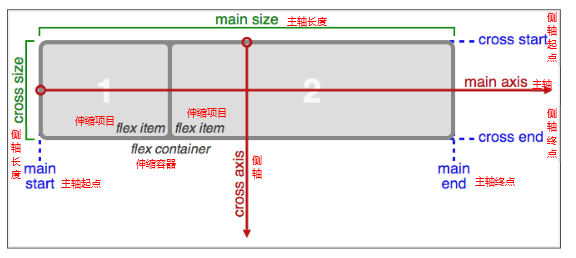

# 1. 弹性布局(Flex)

<!-- TOC -->

- [1. 弹性布局(Flex)](#1-弹性布局flex)
  - [1.1. 容器的属性](#11-容器的属性)
    - [1.1.1. `flex-direction`](#111-flex-direction)
    - [1.1.2. `justify-content`](#112-justify-content)
    - [1.1.3. `align-items`](#113-align-items)
    - [1.1.4. `flex-wrap`](#114-flex-wrap)
    - [1.1.5. `align-content`](#115-align-content)
  - [1.2. 元素的属性](#12-元素的属性)
    - [1.2.1. `order`](#121-order)
    - [1.2.2. `flex-grow`](#122-flex-grow)
    - [1.2.3. `flex-shrink`](#123-flex-shrink)
    - [1.2.4. `flex-basis`](#124-flex-basis)
    - [1.2.5. `flex`](#125-flex)
    - [1.2.6. `align-self`](#126-align-self)

<!-- /TOC -->

> 布局：其实就是调整元素在水平和垂直方向上的布局方式。

CSS3 在布局方面做了非常大的改进，使得我们对块级元素的布局排列变得十分灵活，适应性非常强，其强大的伸缩性，在响应式开中可以发挥极大的作用。

当给一个盒子设置了 `display：flex` 之后，这个盒子就有了**主轴** 和**侧轴** 的概念。
**主轴**：Flex 容器的主轴主要用来配置 Flex 项目，默认是水平方向
**侧轴**：与主轴垂直的轴称作侧轴，默认是垂直方向的


注意，设为 Flex 布局以后，子元素的 float、clear 和 vertical-align 属性将失效。

## 1.1. 容器的属性

### 1.1.1. `flex-direction`

> flex-diretion 主要是用来调整主轴的方向的，默认是水平方向
>
> 了解即可，一般来说，很少调整主轴的方向。

可选值

```javascript
row：主轴方向为水平向右（默认值）
column：主轴方向为竖直向下
row-reverse:主轴方向为水平t向左
column-reverse:主轴方向是竖直向上。
```

### 1.1.2. `justify-content`

> justify-content 主要用来设置**主轴方向的对齐方式** ，可选的值有：

```javascript
flex-start（默认值）: 左对齐
flex-end: 右对齐
center: 居中对齐
space-around: 每个元素两侧的间隔相等
space-between:两端对齐，项目之间的间隔都相等
```

### 1.1.3. `align-items`

> align-items 用于调整**侧轴的对其方式** ，可选的值有：

```javascript
flex-start： 元素在侧轴的起始位置对齐。
flex-end： 元素在侧轴的结束位置对齐。
center： 元素在侧轴上居中对齐。
baseline：元素的第一行文字的基线对齐。
stretch（默认值）： 如果项目未设置高度或设为auto，将占满整个容器的高度。
```

### 1.1.4. `flex-wrap`

> flex-wrap 属性控制 flex 容器是单行或者多行,默认不换行

```javascript
nowrap： 不换行（默认），会压缩子盒子的宽度。
wrap： 当宽度不够的时候，会换行。
```

### 1.1.5. `align-content`

> align-content 用来设置多行的 flex 容器的排列方式。

```javascript
flex-start： 各行向侧轴的起始位置堆叠。
flex-end： 各行向弹性盒容器的结束位置堆叠。
center： 各行向弹性盒容器的中间位置堆叠。
space-between： 各行在侧轴中平均分布。
space-around： 第一行贴上边，最后一个行贴下边,其他行在弹性盒容器中平均分布。
stretch：拉伸，不设置高度的情况下。
```

**align-items 与 align-content 的区别**：

```javascript
align-items调整的是侧轴的对其方式，不换行一般用align-items
align-content:必须是多行才生效，如果单行，没有效果。换行了就用align-content。
```

## 1.2. 元素的属性

### 1.2.1. `order`

> order 属性定义项目的排列顺序。数值越小，排列越靠前，默认为 0。

```javascript
order: 1;
```

### 1.2.2. `flex-grow`

> flex-grow 属性定义项目的放大比例，默认为 0，即如果存在剩余空间，也不放大。

```javascript
flex-grow: 1;
```

如果所有项目的 `flex-grow` 属性都为 1，则它们将等分剩余空间（如果有的话）。如果一个项目的 `flex-grow` 属性为 2，其他项目都为 1，则前者占据的剩余空间将比其他项多一倍。

### 1.2.3. `flex-shrink`

> flex-shrink 属性定义了项目的缩小比例，默认为 1，即如果空间不足，该项目将缩小。

```javascript
flex-shrink: 1;
```

如果所有项目的 `flex-shrink` 属性都为 1，当空间不足时，都将等比例缩小。如果一个项目的 `flex-shrink` 属性为 0，其他项目都为 1，则空间不足时，前者不缩小。

负值对该属性无效。

### 1.2.4. `flex-basis`

> flex-basis 属性定义了在分配多余空间之前，项目占据的主轴空间（main size）。浏览器根据这个属性，计算主轴是否有多余空间。它的默认值为 auto，即项目的本来大小。

### 1.2.5. `flex`

> flex 属性是 flex-grow, flex-shrink 和 flex-basis 的简写，默认值为 0 1 auto。后两个属性可选。

```javascript
flex: 1;
```

该属性有两个快捷值：auto (1 1 auto) 和 none (0 0 auto)。

建议优先使用这个属性，而不是单独写三个分离的属性，因为浏览器会推算相关值。

### 1.2.6. `align-self`

> align-self 属性允许单个项目有与其他项目不一样的对齐方式，可覆盖 align-items 属性。默认值为 auto，表示继承父元素的 align-items 属性，如果没有父元素，则等同于 stretch。

```javascript
align-self: auto | flex-start | flex-end | center | baseline | stretch;
```
