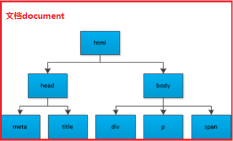

<!-- TOC -->

- [1. 文档对象类型(DOM)](#1-文档对象类型dom)
  - [1.1. DOM 节点`node`](#11-dom-节点node)
    - [1.1.1. 节点分类](#111-节点分类)
    - [1.1.2. 节点层次](#112-节点层次)
  - [1.2. DOM 节点属性](#12-dom-节点属性)
    - [1.2.1. 标签的内容属性](#121-标签的内容属性)
      - [1.2.1.1. `innerHTML`](#1211-innerhtml)
      - [1.2.1.2. `innerText`](#1212-innertext)
      - [1.2.1.3. 区别](#1213-区别)
    - [1.2.2. 节点的属性](#122-节点的属性)
      - [1.2.2.1. `nodeName`](#1221-nodename)
      - [1.2.2.2. `nodeValue`](#1222-nodevalue)
      - [1.2.2.3. `nodeType`](#1223-nodetype)
    - [1.2.3. 节点的查找](#123-节点的查找)
      - [1.2.3.1. 找孩子](#1231-找孩子)
      - [1.2.3.2. 找兄弟](#1232-找兄弟)
      - [1.2.3.3. 找父亲](#1233-找父亲)
  - [1.3. 获取元素的方法](#13-获取元素的方法)
    - [1.3.1. `getElementById()`](#131-getelementbyid)
    - [1.3.2. `getElementByTagName()`](#132-getelementbytagname)
    - [1.3.3. `getElementsByClassName()`](#133-getelementsbyclassname)
    - [1.3.4. `getElementsByTagName()`](#134-getelementsbytagname)
    - [1.3.5. `querySelector()`](#135-queryselector)
    - [1.3.6. `querySelectorAll()`](#136-queryselectorall)
    - [1.3.7. 网页元素](#137-网页元素)

<!-- /TOC -->

# 1. 文档对象类型(DOM)

> DOM ( Document Object Model ) 文档对象模型, 是`W3C组织`推荐的一套操作网页元素的应用程序接口(API)。

`D`（文档）可以理解为整个 Web 加载的网页文档，`O`（对象）可以理解为类似 window 对象只来的东西，可以调用属性和方法，这里我们说的是 document 对象，`M`（模型）可以理解为网页文档的树形结构，DOM 树由节点构成

```html
<html lang="en">
<head>
  <meta charset="UTF-8">
  <title>Document</title>
</head>
<body>
  <div></div>
  <p></p>
  <span></span>
</body>
</html>
```

## 1.1. DOM 节点`node`

文档中的所有内容都可表示为一个节点(node)，如：HTML 里整个文档、每个标签、每个标签的属性和文本都可作为一个节点。

### 1.1.1. 节点分类

① 文档节点(Document)：整个 XML、HTML 文档

② 元素节点(Element)：每个 XML、HTML 元素

③ 属性节点(Attr)：每个 XML、HTML 元素的属性

④ 文本节点(Text)：每个 XML、HTML 元素内的文本

⑤ 注释节点(Comment)：每个注释

### 1.1.2. 节点层次

节点彼此都有等级关系：父节点、兄弟节点、子节点等等。


## 1.2. DOM 节点属性

介绍 HTML DOM 节点属性，如：innerHTML、innerText、nodeName、nodeValue 以及 nodeType 等。

### 1.2.1. 标签的内容属性

#### 1.2.1.1. `innerHTML`

以 HTML 代码格式获取或设置节点的内容

获取标签内容的时候，不管标签还是文本，都能获取到
`innerHTML`设置内容的时候，覆盖原来内容，标签也能生效，浏览器能解析这个标签

#### 1.2.1.2. `innerText`

获取或设置节点的文本内容

获取标签内容的时候，只会获取文本，标签扔掉了
设置标签内容的时候，覆盖原来内容，对标签进行转义（目的：把标签直接当文本来用）

兼容性

1. `innerText`是 IE 提出来的属性，因此低版本的火狐浏览器不支持这个属性。
2. 火狐有一个`textContent`属性，效果跟`innerText`一样，但是 IE678 不支持这个属性

innerText 的兼容性代码:

```JavaScript
function getInnerText(element){
  if(typeof element.innerText === "string"){
    return element.innerText;
  } else {
    return element.textContent;
  }
}
```

#### 1.2.1.3. 区别

- 共同点 : 都是用来获取和设置标签的内容的
- 区别 :
  - `innerHTML`可以用于获取和设置标签的所有内容，包括标签和文本内容
  - `innerText`只识别文本，标签会被转义。（可以防止 xss 攻击）

### 1.2.2. 节点的属性

#### 1.2.2.1. `nodeName`

获取节点名称，只读属性
**说明**：

| 节点类型           | nodeName          |
| ------------------ | ----------------- |
| 文档节点(Document) | 返回 #document    |
| 元素节点(Element)  | 返回 大写元素名称 |
| 属性节点(Attr)     | 返回 属性名称     |
| 文本节点(Text)     | 返回 #text        |

**示例**：

```JavaScript
console.log( document.nodeName ); // => #document：文档节点
console.log( document.body.nodeName ); // => BODY：元素节点
console.log( document.getElementById('div').nodeName ); // => DIV：元素节点
console.log( document.getElementById('div').attributes.style.nodeName ); // => style：属性节点
```

#### 1.2.2.2. `nodeValue`

获取或设置节点的值

**说明**：文档节点、元素节点此属性返回 null，并且为只读。

| 节点类型           | nodeValue          |
| ------------------ | ------------------ |
| 文档节点(Document) | 只读，返回 null    |
| 元素节点(Element)  | 只读，返回 null    |
| 属性节点(Attr)     | 获取或设置属性的值 |
| 文本节点(Text)     | 获取或设置文本的值 |

**示例**：

```JavaScript
<div style="width:200px;height:100px;border:1px solid black" id="div">
<span>文本1</span>
文本2
</div>
console.log( document.nodeValue ); // => null：文档节点
console.log( document.body.nodeValue ); // => null：元素节点
console.log( document.getElementById('div').nodeValue ); // => null：元素节点
console.log( document.getElementById('div').attributes.style.nodeValue ); // => width:200px;height:100px;border:1px solid black;：style属性的值
document.getElementById('div').attributes.style.nodeValue = ' width:200px;height:200px'; // 设置style属性的值
```

#### 1.2.2.3. `nodeType`

返回节点类型，只读属性

**说明**：

| 节点类型           | nodeType |
| ------------------ | -------- |
| 文档节点(Document) | 9        |
| 元素节点(Element)  | 1        |
| 属性节点(Attr)     | 2        |
| 文本节点(Text)     | 3        |

**示例**：

```JavaScript
console.log( document.nodeType ); // => 9：文档节点
console.log( document.body.nodeType ); // => 1：元素节点
console.log( document.getElementById('div').nodeType ); // => 1：元素节点
console.log( document.getElementById('div').attributes.style.nodeType ); // => 2：属性节点
```

### 1.2.3. 节点的查找

#### 1.2.3.1. 找孩子

```JavaScript
// 找孩子
var ul = document.querySelector('ul');

      //1. childNodes 获取所有的子节点
      console.log(ul.childNodes);

      //2. children 获取所有的子元素
      console.log(ul.children);

      //3. firstChild  第一个子节点
      console.log(ul.firstChild);

      //4. firstElementChild  第一个子元素
      console.log(ul.firstElementChild);

      //5. lastChild 最后一个子节点
      console.log(ul.lastChild);

      //6. lastElementChild 最后一个子元素
      console.log(ul.lastElementChild);

      //7. children[2]  任意一个
      console.log(ul.children[2]);
```

#### 1.2.3.2. 找兄弟

```JavaScript
// 找兄弟 sibling 兄弟姊妹
var l2 = document.querySelector('.l');

      //1. nextSibling  下一个兄弟节点
      console.log(l2.nextSibling);

      //2. nextElementSibling 下一个兄弟元素
      console.log(l2.nextElementSibling);

      //3. previousSibling 上一个兄弟节点
      // previous 上一个
      console.log(l2.previousSibling);

      //4. previousElementSibling 上一个兄弟元素
      console.log(l2.previousElementSibling);
```

#### 1.2.3.3. 找父亲

```JavaScript
// 找父亲
//1. parentElement 父元素 ie9+
console.log( son.parentElement);

      //2. parentNode   父节点  (下面的 ) ie6789+
      console.log(son.parentNode);
```

## 1.3. 获取元素的方法

### 1.3.1. `getElementById()`

获取指定 ID 的元素。

**参数**：

元素 ID。

**返回值**：

元素节点对象。若没有找到，返回 null。

**示例**：

```JavaScript
document.getElementById()
//功能：通过id 获取元素
document : 文档对象
get : 得到
element:元素
by:通过
id:id值
// 参数 : 字符串类型的id
//返回值 : 一个元素 一个对象
var div = document.getElementById('div');
console.dir(div);
```

**注意**：

① HTML 元素 ID 是区分大小写的。

② 若没有找到指定 ID 的元素，返回 null。

③ 若一个父节点下面有多个相同 ID 元素时，默认选取第一个(而不是层级最高的)。

### 1.3.2. `getElementByTagName()`

获取指定标签的元素。

**参数**：

name 名称。

**返回值**：

符合条件的元伪素数组。若没有找到符合条件的，返回空数组。

**示例**：

```JavaScript
var ps = document.getElementsByTagName('p');
```

**注意**：

① `getElementsByTagName()`方法返回元素的顺序是它们在文档中的顺序。

② 返回值有没有获取到元素，都是一个伪数组，即便元素只有一个。

③ 传递给`getElementsByTagName()`方法的字符串可以不区分大小写。

④ 如果把特殊字符串 "\*" 传递给`getElementsByTagName()`方法，它将返回文档中所有元素的列表，元素排列的顺序就是它们在文档中的顺序。

### 1.3.3. `getElementsByClassName()`

获取所有指定类名的元素。

**参数**：

class 名称。

**返回值**：

符合条件的元素伪数组。若没有找到符合条件的，返回空数组。

**示例**：

```JavaScript
var show = document.getElementsByClassName('show'); // 返回一个class包含show的元素数组
```

**注意**：

① `getElementsByClassName( )`方法在几个重要的浏览器中支持的最低版本
谷歌 |IE |火狐
---|---|---
4.0|9.0|3.0

### 1.3.4. `getElementsByTagName()`

通过标签名获取元素。

**参数**：

标签名称。如：div、a 等等

**返回值**：

符合条件的元素伪数组。若没有找到符合条件的，返回空数组。

**示例**：

```JavaScript
document.getElementsByTagName('div'); // 返回一个标签为div的元素数组
```

**注意**：

① 返回值有没有获取到元素，都是一个伪数组，即便元素只有一个

### 1.3.5. `querySelector()`

根据选择器获取一个元素。

**参数**：

选择器

**返回值**：

一个元素。

**示例**：

```JavaScript
var li = document.querySelector('.u1 li');
```

### 1.3.6. `querySelectorAll()`

根据选择器获取全部元素。

**参数**：

选择器

**返回值**：

符合条件的元素伪数组。若没有找到符合条件的，返回空数组。

**示例**：

```JavaScript
var lis = document.querySelectorAll('.u1 li');
```

### 1.3.7. 网页元素

```JavaScript
//1. 获取 body
console.log(document.body);

//2. 获取 html
console.log(document.documentElement);

//3. 获取 head
console.log(document.head);

//4. 获取 title
console.log(document.title);
```
