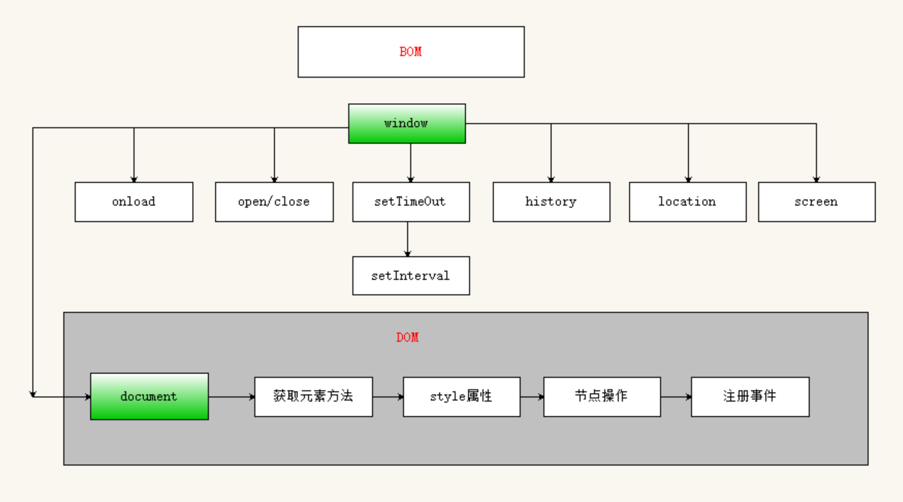

<!-- TOC -->

- [1. 浏览器对象模型(BOM)](#1-浏览器对象模型bom)
  - [1.1. `windows` 对象](#11-windows-对象)
  - [1.2. `location` 对象](#12-location-对象)
    - [1.2.1. 对象属性](#121-对象属性)
    - [1.2.2. 对象方法](#122-对象方法)
    - [1.2.3. 查询字符串参数](#123-查询字符串参数)
  - [1.3. `navigator` 对象](#13-navigator-对象)
  - [1.4. `screen` 对象](#14-screen-对象)
  - [1.5. `history` 对象](#15-history-对象)

<!-- /TOC -->

# 1. 浏览器对象模型(BOM)



## 1.1. `windows` 对象

`BOM` 的核心对象是 `window`，它表示浏览器的一个实例。在浏览器中，`window` 对象有双重角色，既是通过 `JavaScript` 访问浏览器的一个接口，又是 `ECMAScript` 规定的 `global` (全局)对象。这意味着在网页中定义的任何对象，变量和函数，都以 `window` 作为其 `global` 对象。

```JavaScript
window.open(url, [name], [features]);    //打开一个窗口
//参数1：需要载入的url地址
//参数2：新窗口的名称或者targt属性
	//_blank:如果指定为_blank,表示在新的窗口打开
//参数3：窗口的属性，指定窗口的大小
//返回值：会返回刚刚创建的那个窗口，用于关闭

newWin.close()；//关闭刚刚创建的窗口newWin
window.close();//关闭当前窗口

window.alert("message");  //弹出一个具有OK按钮的系统消息框，显示指定的文本

window.confirm("Are you sure?");  //弹出一个具有OK和Cancel按钮的询问对话框，返回一个布尔值

window.prompt("What's your name?", "Default");  //提示用户输入信息，接受两个参数，即要显示给用户的文本和文本框中的默认值，将文本框中的值作为函数值返回

window.status  //可以使状态栏的文本暂时改变

window.defaultStatus  //默认的状态栏信息，可在用户离开当前页面前一直改变文本

window.setTimeout("alert('xxx')", 1000);  //设置在指定的毫秒数后执行指定的代码，接受2个参数，要执行的代码和等待的毫秒数

window.clearTimeout("ID");  //取消还未执行的暂停，将暂停ID传递给它

window.setInterval(function, 1000);  //无限次地每隔指定的时间段重复一次指定的代码，参数同setTimeout()一样

window.clearInterval("ID");  //取消时间间隔，将间隔ID传递给它
```

## 1.2. `location` 对象

`location` 是最有用的 `BOM` 对象之一，它提供了与当前窗口中加载的文档有关的信息，还提供了一些导航功能。下表列出了 `location`对象的所有属性。

### 1.2.1. 对象属性

| 属性     | 描述                                         |
| -------- | -------------------------------------------- |
| hash     | 返回从井号 (#) 开始的 URL（锚）。            |
| host     | 返回主机名和当前 URL 的端口号。              |
| hostname | 返回不带端口号的服务器名称。                 |
| href     | 返回完整的 URL。                             |
| pathname | 返回当前 URL 的路径部分。                    |
| port     | 返回当前 URL 的端口号。                      |
| protocol | 返回当前 URL 的协议。通常是 http：或 https： |
| search   | 返回从问号 (?) 开始的 URL（查询部分）。      |

### 1.2.2. 对象方法

1. `location.assign(URL)` ：设置当前页面加载指定的 url，等同于设置 href 属性的值为 url。

2. `location.reload()` ：重新加载当前页面的 url。可看成为刷新操作。

3. `location.replace(newURL)` ：设置当前页面加载指定的 url，并在浏览器历史记录中替换掉当前地址，进行"后退"操作不会显示当前访问过的记录。

### 1.2.3. 查询字符串参数

尽管 `location.search` 返回从问号到 `URL`末尾的所有内容，但却没有办法逐个访问其中的每个查询字符串参数。为此，可以像下面这样创建一个函数，用以解析查询字符串，然后返回包含所有参数的一个对象：

```JavaScript
function getQueryStringArgs(){
    //取得查询字符串并去掉开头的问号
    var qs = (location.search.length > 0 ? location.search.substring(1) : ""),
    //保存数据的对象
    args = {},
    //取得每一项
    items = qs.length ? qs.split("&") : [],
    item = null,
    name = null,
    value = null,
    //在for 循环中使用
    i = 0,
    len = items.length;
    //逐个将每一项添加到args 对象中
    for (i=0; i < len; i++){
      item = items[i].split("=");
      name = decodeURIComponent(item[0]);
      value = decodeURIComponent(item[1]);
      if (name.length) {
        args[name] = value;
      }
    }
    return args;
}
```

## 1.3. `navigator` 对象

最早由 `Netscape Navigator 2.0` 引入的 `navigator` 对象，现在已经成为识别客户端浏览器的事实标准,`navigator` 有以下跨浏览器属性和方法。

| 属性            | 描述                                           |
| --------------- | ---------------------------------------------- |
| appCodeName     | 返回浏览器的代码名。                           |
| appMinorVersion | 返回浏览器的次级版本。                         |
| appName         | 返回浏览器的名称。                             |
| appVersion      | 返回浏览器的平台和版本信息。                   |
| browserLanguage | 返回当前浏览器的语言。                         |
| cookieEnabled   | 返回指明浏览器中是否启用 cookie 的布尔值。     |
| cpuClass        | 返回浏览器系统的 CPU 等级。                    |
| onLine          | 返回指明系统是否处于脱机模式的布尔值。         |
| platform        | 返回运行浏览器的操作系统平台。                 |
| systemLanguage  | 返回 OS 使用的默认语言。                       |
| userAgent       | 返回由客户机发送服务器的 user-agent 头部的值。 |
| userLanguage    | 返回 OS 的自然语言设置。                       |

## 1.4. `screen` 对象

`Screen` 对象包含有关客户端显示屏幕的信息。

| 属性                 | 描述                                         |
| -------------------- | -------------------------------------------- |
| availHeight          | 返回显示屏幕的高度 (除 Windows 任务栏之外)。 |
| availWidth           | 返回显示屏幕的宽度 (除 Windows 任务栏之外)。 |
| bufferDepth          | 设置或返回调色板的比特深度。                 |
| colorDepth           | 返回目标设备或缓冲器上的调色板的比特深度。   |
| deviceXDPI           | 返回显示屏幕的每英寸水平点数。               |
| deviceYDPI           | 返回显示屏幕的每英寸垂直点数。               |
| fontSmoothingEnabled | 返回用户是否在显示控制面板中启用了字体平滑。 |
| height               | 返回显示屏幕的高度。                         |
| logicalXDPI          | 返回显示屏幕每英寸的水平方向的常规点数。     |
| logicalYDPI          | 返回显示屏幕每英寸的垂直方向的常规点数。     |
| pixelDepth           | 返回显示屏幕的颜色分辨率（比特每像素）。     |
| updateInterval       | 设置或返回屏幕的刷新率。                     |
| width                | 返回显示器屏幕的宽度。                       |

## 1.5. `history` 对象

```JavaScript
//后退一页
history.go(-1);

//前进一页
history.go(1);

//前进两页
history.go(2);

//跳转到最近的包含'wrox.com'字符的页面
history.go("wrox.com");

//后退一页
history.back();

//前进一页
history.forward();

if (history.length == 0){
//用户打开窗口后的第一个页面
}
```
