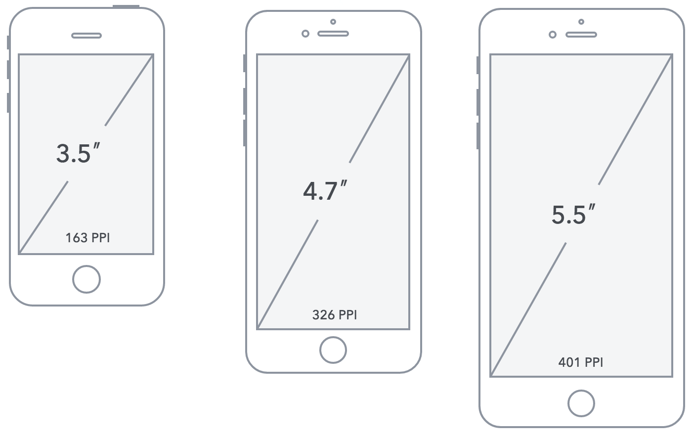
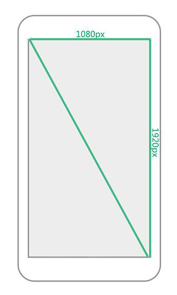
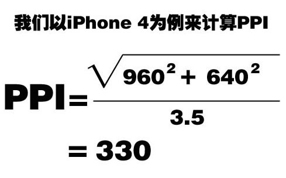

# 1. 移动 Web

## 1.1. 移动 Web 基础

### 1.1.1. 移动端开发现状

- 移动 web 开发指的是需要适配移动设备的网页开发
- 移动 web 开发与 pc 端 web 开发没有本质的区别，使用的还是 HTML/CSS/JavaScript 的技术

### 1.1.2. 移动 web 开发与 pc 端 web 开发的区别是什么？

1. 浏览器兼容的区别
   移动端 web, 兼容只需要加上 -webkit- 前缀即可
2. 屏幕尺寸的区别
   移动端不能通过设置版心实现多个屏幕的适配, 采用流式布局(百分比布局)完成不同屏幕适配

## 1.2. 移动端开发分类

### 1.2.1. 原生 app（native app）

> 原生 app 是基于操作系统的开发，比如 Android（java），ios（swift），他们只能在各自的操作系统上运行。

**优点**：

1. 可以直接访问操作系统的硬件设备，获取更多的资源（gps，摄像头，传感器，麦克风等）
2. 速度快，性能高，用户体验好
3. 可以离线使用

**缺点**：

1. 开发成本高，需要开发多套代码，跨平台型差
2. 需要安装和更新，更新与发布需要审核

### 1.2.2. 混合 app（Hybrid app）

> Hybrid App 是指介于 web-app、native-app 这两者之间的 app,它虽然看上去是一个 Native App，但只有一个 UI WebView，里面访问的是一个 Web App。（淘宝、京东、手机百度）

Hybird App 说白了就是使用了 Native app 的壳，里面其实还是 HTML5 页面。

优点：

1. 开发成本和难度更低，兼容多个平台
2. 也可以访问手机的操作系统资源。
3. 更新维护更方便

缺点：

1. 用户体验相比原生 app 稍差。
2. 性能依赖于网速

### 1.2.3. web 应用（webApp）

> Web 应用使用 H5C3 开发页面，为浏览器设计的基于 web 的应用，可以在各种智能设备的手机浏览器上运行。不需要安装即可运行。

优点：

1. 支持设备广泛
2. 开发成本低（使用）
3. 可以随时上线与更新，无需审核

缺点：

1. 性能效率上比较低，用户体验极度依赖网速
2. 极为依赖网络环境，要求联网
3. 无法直接获取手机的资源（gps, 传感器等）

三种开发各有优缺点，具体用什么需要根据实际情况而定，比如预算，app 注重功能还是内容等。


## 1.3. 屏幕与分辨率

> 移动设备与 PC 设备最大的差异在于屏幕，这主要体现在屏幕尺寸和屏幕分辨率两个方面。

### 1.3.1. 屏幕尺寸

通常我们所指的屏幕尺寸，实际上指的是屏幕对角线的长度（一般用英寸来度量）如下图所示

`1英寸 = 2.54厘米`



### 1.3.2. 屏幕分辨率

分辨率则一般用像素来度量，表示屏幕水平和垂直方向的像素数，例如 1920\*1080 指的是屏幕垂直方向和水平方向分别有 1920 和 1080 个像素点而构成，如下图所示,相同尺寸下分辨率越高，越清晰。



`像素`：指计算机显示设备中的最小单位，即一个像素点的大小。

像素是相对长度单位，在屏幕分辨率越高的设备，像素点越小，屏幕分辨率越低，像素点越大。


### 1.3.3. 像素密度 ppi

`PPI（Pixels Per Inch）`值来表示屏幕每英寸的像素数

利用 _勾股定理_ 我们可以计算得出 PPI



PPI 值的越大说明单位尺寸里所能容纳的像素数量就越多，所能展现画面的品质也就越精细，反之就越粗糙。

当 PPI 越大，对应单位英寸的像素点个数越多，屏幕质量就越好，展示的画质越精细。

### 1.3.4. 设备独立像素

> 随着技术发展，设备不断更新，出现了不同 PPI 的屏幕共存的状态，给我们开发带来的问题

作为用户是不会关心这些细节的，他们只是希望在不同 PPI 的设备上看到的图像内容差不多大小，所以这时我们需要一个新的单位，`这个新的单位能够保证图像内容在不同的PPI设备看上去大小应该差不多`，这就是独立像素,也叫（设备无关像素），在 IOS 设备上叫`PT`，Android 设备上叫`DP`，在 css 中，叫`PX`。

手机从出厂之后就有一个固有属性，设备像素比 dpr
dpr = 物理像素点的个数 / CSS 像素点的个数
获取设备的像素比

```javascript
window.devicePixelRatio; //物理像素与CSS像素的比值
```

### 1.3.5. 2 倍图与 3 倍图

> 以后同学在工作的过程中，从 UI 那拿到的设计图通常都是 640 的设计图或者是 750 的设计图.

把更多的像素点压缩至一块屏幕里，从而达到更高的分辨率并提高屏幕显示的细腻程度。


设备像素比 devicePixelRatio：即像素的压缩比例

**结论**：在移动端为了在高清屏手机上显示得更加细腻，通常会使用更大的图片，比如 2 倍图或者 3 倍图。

### 1.3.6. 视口 viewport

**视口参数设置**:

```javascript
//width 设置视口的宽度
//width=device-width   设置视口宽度为设备的宽度（常用）

//initial-scale 设置初始缩放比例
//initial-scale=1.0  默认缩放比

//user-scalable 设置是否允许用户缩放
//user-scalable=no  禁用用户缩放，提升用户体验

//maximum-scale  设置允许的最大缩放比例
//maximum-scale=1.0  可以不设置，因为都禁止用户缩放了

//minimum-scale 设置允许最小缩放比
//minimum-scale=1.0  可以不设置，因为都禁用用户缩放了


//标准写法：
//快捷键：  meta:vp + tab键
<meta name="viewport" content="width=device-width, user-scalable=no, initial-scale=1.0">
```

设置视口：

1. 设置视口宽度和设备宽度一致
2. 禁用用户缩放，默认视口缩放比就是 1.0 不缩放

## 1.4. 流式布局

**移动端的特点**：

- 手机端的兼容性问题比 PC 端小很多，因为手机端的浏览器版本比较新
- 手机端屏幕比较小，能够放的内容比较少。

问题：布局的时候怎么解决屏幕大小不一致的问题？

- PC 端：固定版心，让所有分辨率的电脑的版心都是一样的
- 移动端：移动端无法设置版心，因为移动端的设备屏幕本身就小，设置版心不合适。因此移动端大多会采用流式布局（百分比布局）

**流式布局**，也叫百分比布局，是移动端开发中经常使用的布局方式之一。

**流式布局的特征**：

- 宽度自适应，高度写死，并不是百分百还原设计图
- 图标都是固定死大小的，包括字体等也是固定死的。并不是所有的东西都是自适应的。
- 一些大的图片，设置宽度为百分比自适应即可，随着屏幕大小进行变化

## 1.5. touch 事件

移动端新增了4个与手指触摸相关的事件。只在移动端触发

```javascript
//touchstart:手指放到屏幕上时触发
//touchmove:手指在屏幕上滑动式触发（会触发多次）
//touchend:手指离开屏幕时触发
//touchcancel:系统取消touch事件的时候触发,比如电话
```

每个触摸事件被触发后，会生成一个event对象，event对象中`changedTouches`会记录手指滑动的信息。

```javascript
e.touches;//当前屏幕上的手指
e.targetTouches;//当前目标对象上的所有手指
e.changedTouches;// 发生改变的所有手指 (位置改变, 手指从无到有, 从有到无)
```

touchend中，只能通过e.changedTouches来获取手里离开屏幕的坐标

这些列表里的每次触摸由touch对象组成，touch对象里包含着触摸信息，主要属性如下

```javascript
 clientX/clientY    // 指相对于浏览器可视区域的坐标
 screenX/screenY    // 指相对于显示器屏幕的坐标
 pageX/pageY        // 指相对于整个页面左顶点的坐标(加上页面卷去高度的)

```
